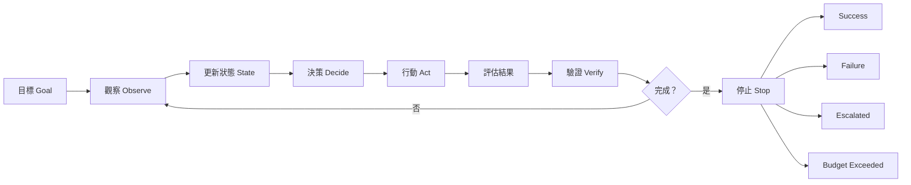
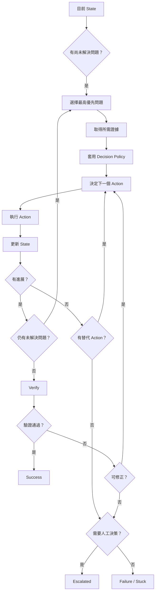
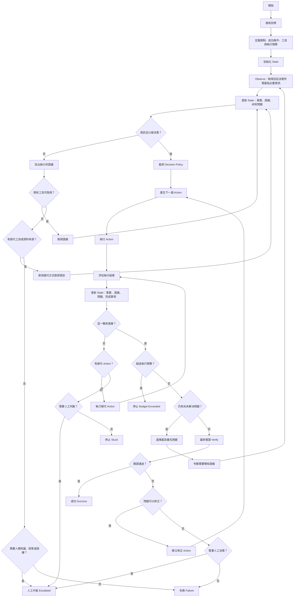

# Agent 執行流程 SOP：Decision、Loop、Stop 與驗證

#ai #agent #workflow #playbook

## 這是什麼

這是一套可重複套用的 Agent 執行流程標準作業程序（SOP）。目的不是讓 Agent「更自由」，而是把 Agent 的控制邏輯明確化：它如何觀察、保存狀態、做決策、執行、驗證、循環、停止，以及什麼時候必須升級人工。

這份 SOP 適用於 Code Review、測試分析、研究、除錯、文件分析、工作流代理等需要多步判斷與工具操作的 Agent。

## 核心結論

成熟 Agent 的重點不是「會呼叫多少工具」，而是：

1. 每次決策都有狀態、規則與證據支持。
2. 每次只執行一個有理由的下一步。
3. 只有存在可解決的未知問題時才繼續循環。
4. 每一輪都必須能證明有進展。
5. 做完之後還要獨立驗證是否真的完成。
6. 成功、失敗、人工升級、預算超限都要有明確停止條件。
7. 缺資料與缺決策權限必須分開處理。
8. Tool、Skill、Agent 的責任不能混在一起。

---

## 1. Agent 核心循環

Agent 的主流程可以壓縮成：



這不是「一直思考直到完成」，而是受狀態、規則、證據與預算約束的控制迴圈。

---

## 2. 接收目標

Agent 接收的應該是「要達成什麼」，不是由使用者把所有步驟全部寫死。

例如：

```text
審查 PR #123，找出可能造成交易錯誤的問題。
```

而不是：

```text
1. 看 diff
2. 看 Service
3. 看 Controller
4. 跑測試
5. 回覆結果
```

實際需要哪些檔案、哪些依賴、哪些測試，應由 State 與 Decision Policy 決定。

Agent 啟動時至少定義：

```yaml
goal:
constraints: []
available_tools: []
budget:
success_criteria: []
```

例如：

```yaml
goal:
  review PR #123

constraints:
  - 不修改程式碼
  - 不直接合併 PR

available_tools:
  - GitHub
  - Repository Search
  - Test Runner

budget:
  max_iterations: 8

success_criteria:
  - 高風險修改完成檢查
  - 關鍵問題有直接證據
  - 沒有尚未處理的阻塞問題
```

---

## 3. 初始化狀態（State）

Agent 不應只依賴模型前後文記住「做到哪裡」，而應建立明確的狀態。

最低限度：

```yaml
state:
  goal:
  observations: []
  facts: []
  evidence: []
  unresolved_questions: []
  findings: []
  actions_taken: []
  inspected_targets: []
  missing_information: []
  iteration: 0
  status: running
```

不同 Agent 可以增加自己的欄位。

例如 Code Review Agent：

```yaml
changed_units: []
risk_level:
required_scope: []
required_tests: []
affected_dependencies: []
```

State 必須讓下一步決策能回答三件事：

```text
目前已經知道什麼？
目前還不知道什麼？
目前已經做過什麼？
```

---

## 4. 觀察（Observe）

Agent 不應一開始就讀取所有可取得的資料。

原則：

> 只取得目前做下一個決策所需的最低必要資訊。

例如目前問題是：

```text
這個 method 的修改會不會影響其他地方？
```

需要的資訊可能只有：

```text
method 定義
method visibility
caller 清單
```

Observe 完成後，更新：

```text
facts
evidence
unresolved_questions
```

不要把「能讀多少」誤認成「應該讀多少」。

---

## 5. 區分觀察、事實、推論與結論

Agent 必須明確區分：

```text
觀察 Observation
事實 Fact
推論 Inference
結論 Conclusion
```

例如：

```text
觀察：
RetryJob.php 第 42 行呼叫 PaymentService::settle()

事實：
RetryJob 是 settle() 的 caller

推論：
retry 流程可能重複執行 settlement

尚不能直接下結論：
一定會重複扣款
```

證據建議保存：

```yaml
evidence:
  source:
  location:
  observation:
  supports:
```

例如：

```yaml
evidence:
  source: RetryJob.php
  location: line 42
  observation: PaymentService::settle() is called
  supports: settle has retry-path caller
```

---

## 6. 決策（Decide）

Decision 不能只是：

```text
我認為下一步應該……
```

應該基於：

```text
Current State
+
Decision Policy
+
Evidence
```

每次決策至少要能表示：

```yaml
decision:
rule_id:
reason:
evidence:
next_action:
target:
```

例如：

```yaml
decision: EXPAND_SCOPE
rule_id: REVIEW-R4
reason:
  changed method has external callers
evidence:
  - RetryJob calls PaymentService::settle()
next_action: INSPECT_FILE
target: RetryJob.php
```

一個可追溯 Decision 必須回答：

```text
為什麼做？
根據什麼做？
符合哪條規則？
下一步做什麼？
```

---

## 7. 決策規則（Decision Policy）

可以確定性判斷的事情，不要交給 LLM 臨場自由決定。

例如：

```text
如果 public interface 被修改
→ 檢查 callers

如果 transaction boundary 被修改
→ 檢查 transaction participants

如果 shared state 被修改
→ 檢查 writer 與 reader

如果 authentication / authorization 被修改
→ 執行安全檢查

如果 payment / balance / settlement 被修改
→ 執行財務一致性檢查

如果現有規則無法涵蓋案例
→ 升級人工判斷
```

能用 Decision Table 表示時，優先使用 Decision Table。

| 條件 | 決策 |
|---|---|
| 只修改 private method，沒有跨模組影響 | 保持目前審查範圍 |
| public method 行為改變 | 擴大到 callers |
| DB schema 改變 | 檢查 model / repository / migration / query |
| transaction 行為改變 | 檢查 transaction boundary |
| 權限邏輯改變 | 執行安全審查 |
| 業務規則無法從程式碼確認 | 升級人工 |

LLM 適合判斷「這次修改是否符合某條件」，但規則本身不應每次重新發明。

---

## 8. 決策不確定時

不要只依賴：

```text
confidence < 0.7
→ 問人
```

LLM 的自評信心不是可靠控制訊號。

應改為檢查：

```text
必要證據是否缺失？
規則是否無法套用？
資料是否互相矛盾？
是否缺乏決策權限？
```

例如：

```text
不知道誰呼叫這個 method
→ 搜尋 caller

不知道系統業務上是否允許負餘額
→ 無法只靠程式碼決定
→ 升級人工
```

核心區分：

```text
缺資料
≠
缺決策權限
```

缺資料：先取得資料。

缺決策權限：停止自行判斷。

---

## 9. 執行行動（Act）

Agent 每次只應執行一個有理由的下一步。

常見行動類型：

```text
READ
SEARCH
CALL_TOOL
RUN_TEST
INSPECT
COMPARE
VERIFY
MODIFY
ASK_HUMAN
```

每個行動應記錄：

```yaml
action:
target:
reason:
result:
success:
new_evidence:
```

禁止看到一個問題後，同時自行展開大量方向，卻沒有記錄每個方向為什麼需要。

---

## 10. 評估行動結果

Action 完成後不能直接跳到下一個工具。

先問：

> 這個行動讓 State 多知道了什麼？

至少更新：

```yaml
new_facts: []
resolved_questions: []
new_questions: []
state_changes: []
```

例如：

```yaml
new_facts:
  - RetryJob retries failed settlements

resolved_questions:
  - settle() has retry caller

new_questions:
  - Is settlement idempotent?

state_changes:
  - review scope expanded to RetryJob
```

---

## 11. 未解決問題（Unresolved Questions）

Agent 的 Loop 應主要由明確的未解決問題驅動。

例如：

```yaml
unresolved_questions:
  - Is settlement idempotent?
  - Can retry cause duplicated wallet deduction?
```

每次循環：

```text
選最高優先問題
↓
判斷需要什麼證據
↓
選擇行動
↓
取得結果
↓
更新 State
↓
重新排序問題
```

不要使用：

```text
持續思考直到完成。
```

真正的 Loop Condition 必須知道「是哪一個問題還沒解決」。

---

## 12. 循環（Loop）

只有兩種主要理由可以繼續循環：

1. 仍存在可以透過現有能力解決的 unresolved question。
2. Verification 失敗，但存在明確且可執行的修正行動。

流程：

```text
unresolved_questions != empty
        ↓
選擇最高優先問題
        ↓
決定所需 evidence
        ↓
執行 action
        ↓
更新 state
        ↓
再次判斷
```

不要採用：

```text
while agent_feels_not_done:
    think_more()
```

---

## 13. Decide / Loop / Stop 控制模型



這張圖是整套 Agent Flow 的控制核心。

---

## 14. 進度判斷（Progress Detection）

每一輪都必須回答：

> 這一輪有沒有實際進展？

進展可以定義為：

```text
new_facts > 0
OR
resolved_questions > 0
OR
state_changed
OR
verification_result_changed
```

如果：

```text
new_facts = 0
resolved_questions = 0
state_changes = 0
```

代表沒有進度，不應直接重複同一個行動。

---

## 15. 沒有進度時

沒有進度時依序判斷：

```text
目前 Action 失敗？
 ↓
有替代 Action？
 ├─ 有 → 使用替代方案
 └─ 無
      ↓
   缺必要資訊？
      ├─ 是 → 能否從其他來源取得？
      └─ 否
           ↓
       人工升級或失敗停止
```

例如：

```text
grep 找不到 caller
↓
改用 language server / IDE index
↓
仍找不到
↓
確認是否 dynamic dispatch
↓
仍無法確認
↓
標記 unresolved 並決定升級或停止
```

不是單純重試相同行動。

---

## 16. 循環安全機制（Loop Guard）

每個 Agent 都應設定執行預算。

例如：

```yaml
budget:
  max_iterations: 8
  max_tool_calls: 20
  max_scope_expansions: 3
  max_targets: 20
  max_same_decision: 2
```

數字依 Agent 類型調整，目的在防止：

```text
A → B → C → A → B → C
```

---

## 17. 重複循環偵測

可以建立 Decision Fingerprint：

```text
state_signature
+
decision
+
action
+
target
```

若相同 Fingerprint 超過允許次數：

```text
STOP_LOOP_DETECTED
```

此時只能：

```text
Alternative Action
或
Escalate
或
Failure
```

不能原路無限重試。

---

## 18. 驗證（Verify）

「做完」與「做對」必須分開。

Agent 執行完工作後，需要進入獨立 Verification。

至少檢查：

```text
Goal 是否真的達成？
Evidence 是否足夠？
重要 Finding 是否可被證據支持？
Required checks 是否全部完成？
是否仍存在 blocking unknown？
```

例如 Code Review：

```text
高風險修改都有檢查？
所有必要 caller 都有看？
transaction boundary 有確認？
required tests 有檢查？
關鍵 finding 有直接 evidence？
blocking unresolved question 是否為 0？
```

---

## 19. 停止（Stop）

Agent 不應只有「完成就停止」這種模糊條件。

至少定義四種主要終止狀態：

```text
SUCCESS
FAILURE
ESCALATED
BUDGET_EXCEEDED
```

必要時再增加：

```text
STUCK
ABORTED
```

### SUCCESS

只有 Success Criteria 全部成立才能成功停止。

```text
required evidence complete
AND
blocking questions = 0
AND
verification passed
```

### FAILURE

明確知道任務無法完成，例如：

```text
必要 API 無法取得
必要檔案不存在
必要工具持續失敗
repository 狀態不完整
必要依賴無法存取
```

### ESCALATED

Agent 知道問題存在，但問題超出可自行決策範圍，例如：

```text
業務規則未定義
需求互相矛盾
公司政策未定義
安全策略需要責任人決定
需要額外授權
```

### BUDGET_EXCEEDED

超過：

```text
最大循環次數
最大工具呼叫次數
最大 scope 擴張次數
最大目標數
成本限制
時間限制
```

Agent 必須停止，不得偷偷突破限制。

---

## 20. 人工升級（Human Escalation）

人工升級不是失敗。

判斷流程：

```text
缺資料？
 ↓ 是
可透過現有 Tool 取得？
 ├─ 是 → 取得資料 → Loop
 └─ 否
      ↓
有替代 Tool / 資料來源？
 ├─ 是 → 嘗試替代方案
 └─ 否
      ↓
需要人類知識、政策或授權？
 ├─ 是 → ESCALATE
 └─ 否 → FAILURE
```

人工升級時至少回傳：

```yaml
status: ESCALATED
question:
known_facts: []
evidence: []
decision_blocker:
required_human:
```

不要只回「需要人工確認」，而要清楚指出人工到底需要決定什麼。

---

## 21. 完整 Agent 執行流程



---

## 22. 每一輪標準紀錄

每一輪至少要能表示：

```yaml
iteration: 3

observation:
  - RetryJob calls settle()

facts:
  - settle has retry-path caller

decision:
  type: INSPECT
  rule_id: REVIEW-R4
  reason:
    retry path may execute settlement more than once

action:
  type: READ
  target: RetryJob.php

result:
  new_facts:
    - failed settlement retries three times

  resolved_questions:
    - settle has retry caller

  new_questions:
    - settlement idempotency guaranteed?

progress: true

next:
  action: SEARCH
  target: idempotency implementation
```

---

## 23. Tool、Skill、Agent 的責任分離

### Tool

Tool 回答：

> 我能做什麼？

例如：

```text
GitHub API
File Reader
Search
Test Runner
```

### Skill

Skill 回答：

> 某件事情應該怎麼做？

例如：

```text
Review Scope Reducer
Test Impact Analyzer
Security Inspector
Dependency Analyzer
```

Skill 應接受輸入、執行特定能力、回傳結構化結果，不應自行控制整個 Agent Flow。

### Agent

Agent 回答：

> 現在應該做哪件事？

Agent 負責：

```text
讀取 State
↓
選擇 Skill / Tool
↓
取得結果
↓
更新 State
↓
決定下一步
```

因此：

```text
Tool = 能力介面
Skill = 執行方法
Agent = 控制與決策層
```

---

## 24. LLM 應該負責什麼

LLM 適合：

```text
語意理解
模糊案例判讀
分類
找關聯
產生候選問題
解讀非結構化資料
```

LLM 不應主導：

```text
執行預算
安全邊界
停止條件
權限
固定 business invariant
明確 deterministic 規則
```

例如：

```text
是否修改 transaction boundary
```

可以讓 LLM 協助判讀。

但：

```text
修改 transaction boundary
→ 必須檢查 transaction participants
```

應由 Policy 決定。

---

## 25. 不變條件（Invariant）

成熟 Agent 應定義不可違反的不變條件，例如：

```text
不得在缺乏證據時宣稱問題確定存在。
不得在權限不足時自行修改。
不得超過執行預算。
不得忽略 blocking unresolved question。
不得將推論當成事實。
不得因工具失敗就假設結果不存在。
不得在 Verification 前宣告 Success。
```

---

## 26. 最低可用 Agent 標準

最低可用版本應具備：

```text
明確 Goal
+
State
+
Decision Policy
+
Evidence
+
Tool Action
+
Unresolved Questions
+
Loop Condition
+
Progress Detection
+
Stop Condition
+
Verification
```

更成熟一級則增加：

```text
Execution Budget
+
Loop Detection
+
Human Escalation
+
Alternative Action
+
Invariant
```

---

## 27. Agent 成熟度檢查表

建立或 Review 一個 Agent Flow 時，至少回答：

- Goal 是什麼？
- Success Criteria 是什麼？
- Failure Criteria 是什麼？
- State 保存什麼？
- 哪些是 Fact？
- 哪些是 Inference？
- Evidence 來源在哪？
- Agent 根據什麼做 Decision？
- Decision 有對應 Rule 嗎？
- 哪些判斷是 deterministic？
- 哪些判斷交給 LLM？
- 每次 Action 為什麼執行？
- Action 結果如何更新 State？
- Unresolved Questions 如何管理？
- Loop Condition 是什麼？
- 如何知道這一輪有 Progress？
- 沒有 Progress 時怎麼處理？
- 如何偵測重複循環？
- Execution Budget 是多少？
- 什麼時候 Success？
- 什麼時候 Failure？
- 什麼時候 Escalate？
- 最後如何 Verify？

如果多數問題無法回答，通常只是：

```text
Prompt + Tool Calling
```

還不是穩定的 Agent。

---

## 28. 設計原則總結

整套 SOP 可以壓縮成八條：

1. 只取得目前決策真正需要的資訊。
2. 決策必須由規則與證據支持。
3. 每次只執行一個有理由的下一步。
4. 每個結論都區分事實、推論與未知。
5. 只有尚有可解決問題時才進入下一輪。
6. 每一輪都必須產生可測量的進展。
7. 完成後必須再次驗證。
8. 無法自行決定時，停止並升級人工。

Agent 的成熟度不在於它能自己做多少事情，而在於它是否清楚知道：

```text
什麼時候可以自己決定，
什麼時候需要更多證據，
什麼時候應該繼續，
什麼時候必須停止，
以及每一個決策是否都能被追溯。
```

---

## 文件類型

Playbook：可重複執行的 Agent 設計、檢查與治理流程。

## 適用範圍與限制

- 本文件描述通用 Agent Flow，不取代各領域自己的 Business Rule、Security Policy 或 Domain Invariant。
- Decision Policy 應由實際領域規則補完，不應只依賴本文件中的示意規則。
- 執行預算數字沒有通用最佳值，應依任務成本、風險與工具特性調整。
- 高風險操作仍需額外權限、審批與安全限制，不能因 Agent Flow 完整就自動取得決策權。