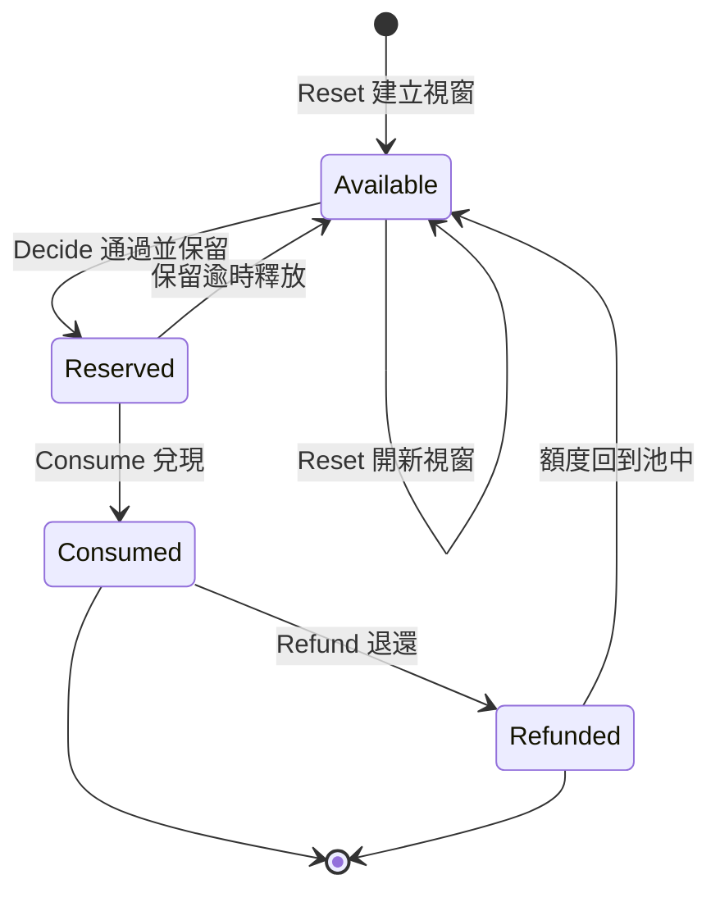
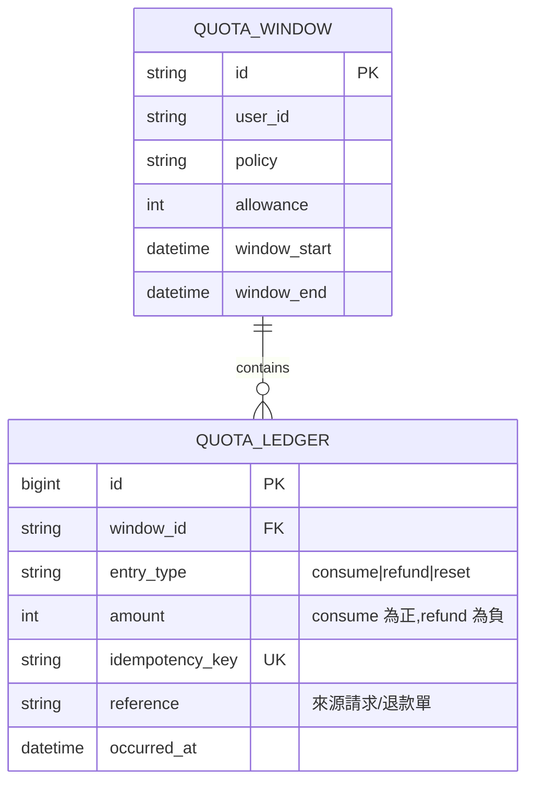
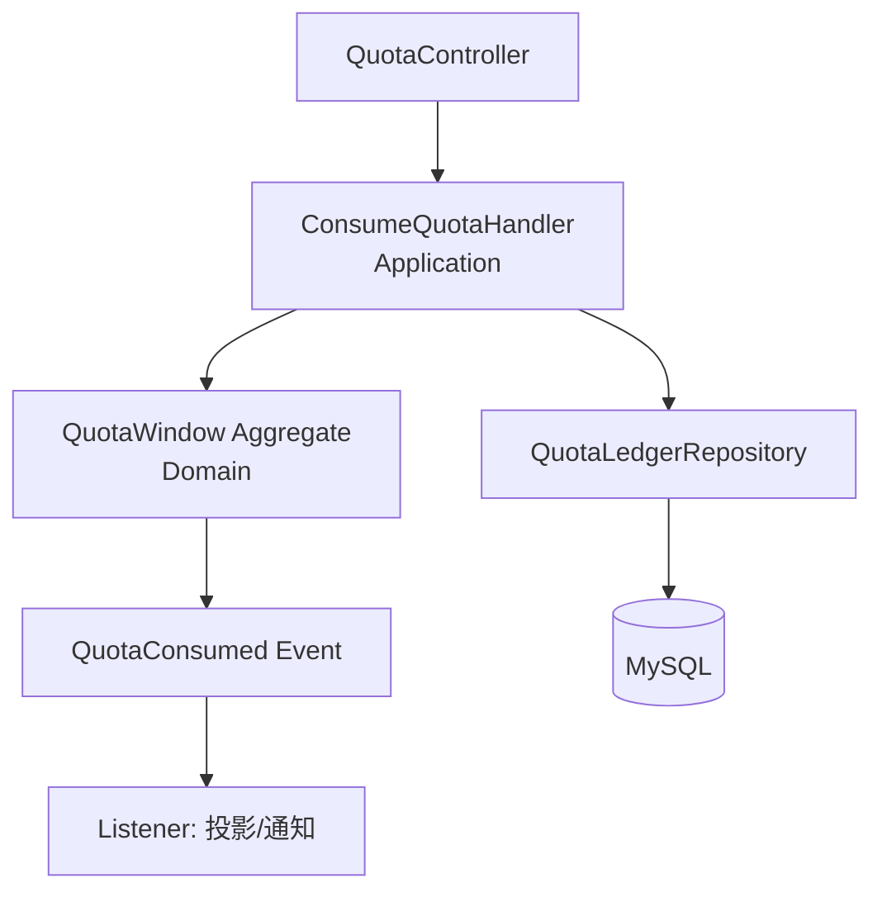

# 配額系統完整範例：Decide、Consume、Refund、Reset 與 Ledger

#quota-domain #laravel-architecture #event-sourcing #ledger #specification-example

## 這是什麼

這是一份完整的配額（Quota）系統規格範例，把前面幾篇的方法——契約設計、資料模型收斂、時間序列模擬、可執行驗證——實際走一遍，並落成一套 Laravel 分層實作。它刻意選配額這個領域，因為它同時具備並行、時間視窗、可逆操作與稽核需求，是規格工程各種難題的匯集點。

配額看似簡單（「每小時 100 次」），但一旦加上「失敗要退還」「跨視窗要重置」「所有變動要能對帳」，它就變成一個需要嚴謹規格的領域。這正是拿來示範的理由。

## 核心結論

配額系統的真相來源不是「剩餘量」這個數字，而是一連串不可變的變動流水（Ledger）。剩餘量是 Ledger 的投影，任何時候都能重算。把 Ledger 當核心、剩餘量當衍生，是這個領域最重要的一個設計決策——它讓退還、重置、對帳、爭議查詢全都變成 Ledger 上的操作，而不是對一個可變數字的修修補補。

五個操作構成完整生命週期：`Decide`（能不能）、`Consume`（扣）、`Refund`（退）、`Reset`（視窗重置）、`Ledger`（記錄一切）。

## 領域生命週期



每一次轉移都在 Ledger 上寫一筆不可變記錄。剩餘量永遠是 `視窗額度 − Σ(consume) + Σ(refund)`，從不直接被寫。

## 為什麼 Ledger 是核心而非稽核附屬

天真的設計會建一張 `quotas` 表,存 `remaining` 欄位,每次消費就 `remaining -= amount`。這個設計會在三個地方崩潰:

- **退還**:要退還一次消費,你得知道當初扣了多少、扣在哪個視窗。一個可變的 `remaining` 數字不記得這些,你只能再加回去,但無法防止重複退還。
- **對帳**:客服問「這個使用者昨天 23:47 為什麼被拒?」,一個 `remaining` 數字答不出來,因為它只有現在的值,沒有歷史。
- **並行**:`remaining -= amount` 這種讀改寫在並行下會遺失更新,除非小心加鎖,而鎖的粒度又是另一個規格問題。

把 Ledger 當核心,這三個問題一起消失。Ledger 是 append-only 的事實流,每筆記錄不可變:



`remaining` 不在任何表裡。它是 `SELECT allowance - SUM(amount) FROM ledger WHERE window_id = ?` 的結果。這正是第 02 篇「Fact 必須保留、Derived 可以重算」原則的具體落地。

## MySQL Schema 與 Laravel Migration

```php
Schema::create('quota_windows', function (Blueprint $table) {
    $table->ulid('id')->primary();
    $table->string('user_id')->index();
    $table->string('policy');              // fixed_hourly 等
    $table->unsignedInteger('allowance');  // 該視窗總額度
    $table->dateTime('window_start');
    $table->dateTime('window_end');
    $table->timestamps();

    // 同一使用者同一視窗只能有一筆——固定視窗的天然唯一性
    $table->unique(['user_id', 'policy', 'window_start']);
});

Schema::create('quota_ledger', function (Blueprint $table) {
    $table->bigIncrements('id');
    $table->foreignUlid('window_id')->constrained('quota_windows');
    $table->enum('entry_type', ['consume', 'refund', 'reset']);
    $table->integer('amount'); // consume 正、refund 負,以正負號統一 SUM
    $table->string('idempotency_key');
    $table->string('reference')->nullable();
    $table->dateTime('occurred_at');
    $table->timestamps();

    // 冪等的地基:同一 key 不得寫入兩次
    $table->unique('idempotency_key');
    $table->index(['window_id', 'occurred_at']);
});
```

兩個唯一約束承載了整個系統的正確性保證:`quota_windows` 的複合唯一鍵讓「同一視窗」有明確定義並防止重複建立;`quota_ledger.idempotency_key` 的唯一約束讓冪等不靠應用層的檢查、而靠資料庫的原子性——這是防止重複 callback、重複退款的最後一道、也是最可靠的一道防線。

## Laravel 分層



分層的意義不是形式,而是責任隔離:Controller 只翻譯 HTTP;Application 管交易邊界與冪等;Domain 守不變量;Repository 管持久化。規格中的每條規則都應該能指到它被哪一層守護。

### Domain:守不變量的聚合

```php
final class QuotaWindow
{
    public function __construct(
        private readonly QuotaWindowId $id,
        private readonly int $allowance,
        private int $consumed, // = SUM(consume) - SUM(refund),由 Ledger 重建
    ) {}

    /** Decide 不改變狀態,只回報——語意在第 05 篇已明確選定為「預覽」。 */
    public function decide(int $amount): Decision
    {
        $remaining = $this->allowance - $this->consumed;
        return $remaining >= $amount
            ? Decision::allow($remaining)
            : Decision::reject($remaining, shortfall: $amount - $remaining);
    }

    /** Consume 重新驗證,產生一筆 Ledger 事實,絕不信任先前的 Decide。 */
    public function consume(int $amount, IdempotencyKey $key): QuotaConsumed
    {
        $remaining = $this->allowance - $this->consumed;
        if ($remaining < $amount) {
            throw new InsufficientQuota($remaining, shortfall: $amount - $remaining);
        }
        $this->consumed += $amount;
        return new QuotaConsumed($this->id, $amount, $key);
    }

    /** Refund 是 Consume 的逆,同樣產生不可變 Ledger 記錄。 */
    public function refund(int $amount, Reference $original): QuotaRefunded
    {
        if ($amount > $this->consumed) {
            throw new RefundExceedsConsumption();
        }
        $this->consumed -= $amount;
        return new QuotaRefunded($this->id, $amount, $original);
    }
}
```

聚合不知道資料庫存在。它接收由 Ledger 重建的 `consumed`,守住「不得超額」「退還不得超過已消費」兩條不變量,產生描述已發生事實的事件。這讓不變量可以被單元測試直接攻擊,不需要資料庫。

### Application:交易邊界與冪等

```php
final class ConsumeQuotaHandler
{
    public function __construct(
        private QuotaWindowRepository $windows,
        private QuotaLedgerRepository $ledger,
        private DatabaseManager $db,
    ) {}

    public function handle(ConsumeQuotaCommand $cmd): ConsumeResult
    {
        return $this->db->transaction(function () use ($cmd) {
            // 冪等優先:同一 key 已處理過,回傳既有結果,不重複扣。
            if ($existing = $this->ledger->findByKey($cmd->idempotencyKey)) {
                return ConsumeResult::fromLedger($existing);
            }

            // 鎖住視窗並由 Ledger 重建聚合,確保並行下讀到最新 consumed。
            $window = $this->windows->lockForUser($cmd->userId, $cmd->at);

            $event = $window->consume($cmd->amount, $cmd->idempotencyKey);
            $this->ledger->append($event); // 唯一約束是冪等的最後防線

            return ConsumeResult::allowed($window->remaining());
        });
    }
}
```

這一層是第 04、05 篇談的並行與冪等在程式裡的落點。三件事發生在同一個交易與同一把鎖之下:冪等檢查、聚合重建、Ledger 寫入。少了任何一項,並行的兩個請求就能同時通過檢查、同時扣款。冪等檢查放在最前面,呼應第 04 篇 Decision Table 的教訓——冪等必須先於狀態檢查,否則重複的成功 callback 會被錯誤地當成新請求拒絕。

### Controller 與 DTO

```php
final class QuotaController
{
    public function consume(ConsumeQuotaRequest $request, ConsumeQuotaHandler $handler)
    {
        $result = $handler->handle(new ConsumeQuotaCommand(
            userId: UserId::from($request->user()->id),
            amount: $request->integer('amount'),
            idempotencyKey: IdempotencyKey::from($request->header('Idempotency-Key')),
            at: now()->toImmutable(),
        ));

        return response()->json([
            'allowed' => $result->allowed,
            'remaining' => $result->remaining,
        ], $result->allowed ? 200 : 429);
    }
}
```

Controller 只做一件事:把 HTTP 翻譯成命令、把結果翻譯回 HTTP。它不含任何業務判斷。`Idempotency-Key` 從 header 進來、一路傳到 Ledger 的唯一約束,這條貫穿全棧的路徑就是冪等承諾的實體化。

## Reset:視窗重置作為 Ledger 事件

Reset 不是刪掉舊資料。舊視窗的 Ledger 永遠保留(對帳與爭議查詢需要),Reset 只是建立一個新視窗:

```php
final class ResetQuotaHandler
{
    public function handle(ResetQuotaCommand $cmd): void
    {
        $window = QuotaWindow::open(
            user: $cmd->userId,
            policy: $cmd->policy,
            allowance: $cmd->allowance,
            start: $cmd->windowStart,
        );
        $this->windows->save($window);
        // 舊視窗與其 Ledger 原封不動保留
    }
}
```

固定視窗策略下,Reset 通常是惰性的:請求進來時算出它屬於哪個視窗,若該視窗不存在就即時建立,而不是靠排程去「重置」所有使用者。這避免了在整點瞬間對全體使用者做批次寫入。惰性建立的決策本身應該寫回規格,因為它影響「視窗第一筆請求」的行為。

## 用可執行規格驗證

每條不變量對應一個測試,測的是業務規則而非 SQL:

```php
it('並行消費不會超額', function () {
    seedWindow(user: 'u1', allowance: 100);

    // 模擬兩個請求搶最後的額度
    $r1 = consume('u1', 60, key: 'req-1');
    $r2 = consume('u1', 60, key: 'req-2');

    expect([$r1->allowed, $r2->allowed])->toContain(false)
        ->and(remaining('u1'))->toBeGreaterThanOrEqual(0);
})->group('specification');

it('重複的冪等鍵不會重複扣款', function () {
    seedWindow(user: 'u1', allowance: 100);

    $first = consume('u1', 30, key: 'evt-1');
    $second = consume('u1', 30, key: 'evt-1'); // 同一 key 重送

    expect($second->remaining)->toBe($first->remaining)
        ->and(ledgerCount('u1'))->toBe(1);
});

it('退還後額度回到池中且不可重複退', function () {
    seedWindow(user: 'u1', allowance: 100);
    consume('u1', 40, key: 'c-1');

    refund('u1', 40, original: 'c-1');
    expect(remaining('u1'))->toBe(100);

    // 重複退還應被拒
    expect(fn () => refund('u1', 40, original: 'c-1'))
        ->toThrow(RefundExceedsConsumption::class);
});
```

這些測試直接對應第 03 篇的追蹤矩陣:每個 `it` 綁一條不變量、一個情境、一個規格 ID。當規格改變時,能明確找到哪些測試需要重跑。

## 引導 AI 建立這個範例的 Prompt

```text
我們要設計一個配額系統,操作有 Decide、Consume、Refund、Reset。
先不要寫任何資料表。請依序回答:
1. 列出這個領域的不變量(用 INV-xxx 編號),特別是並行與退還相關。
2. 判斷「剩餘量」該是儲存的事實還是衍生值,說明理由。
3. 若採 Ledger 為核心,列出 Ledger 每筆記錄的最小欄位,並說明
   冪等如何靠資料庫約束保證,而非靠應用層檢查。
4. 給一條並行時間軸,證明你的設計不會超額。
不得以「一般限流做法」補齊未定義處;任何需要業務裁決的地方標為 OPEN QUESTION。
```

## 常見錯誤

- **存 remaining 當可變欄位**:一切退還、對帳、爭議查詢的困難都源於此。Ledger 為核心、remaining 為衍生,才是正確起點。
- **冪等靠應用層 if 檢查**:並行下兩個請求可能同時通過 `if (already processed)` 檢查。冪等必須落在資料庫唯一約束上。
- **Reset 用刪除或覆蓋**:刪掉舊視窗就毀了對帳能力。Reset 是開新視窗,舊 Ledger 永久保留。
- **Decide 與 Consume 之間信任先前結果**:`Consume` 若不重新驗證餘額,`Decide` 通過後的並行消費就會超額。每次 `Consume` 都要在鎖內重新檢查。
- **退還不記來源**:`Refund` 若不綁定原始消費的 reference,就無法防止重複退還,也無法對帳。退還必須是可追溯的逆操作。
- **把 Controller 塞業務邏輯**:一旦 Controller 開始判斷餘額,同樣的規則就會散落在多處。業務判斷屬於 Domain,交易邊界屬於 Application。

## Checklist

- 剩餘量是否為 Ledger 的衍生值,而非儲存的可變欄位?
- Ledger 是否 append-only、每筆不可變?
- 冪等是否由資料庫唯一約束保證,而非應用層檢查?
- `Consume` 是否在鎖與交易內重新驗證餘額?
- `Refund` 是否綁定原始消費 reference 並防止重複退還?
- `Reset` 是否保留舊視窗與 Ledger,只建立新視窗?
- 每條不變量(超額、重複退、冪等)是否都有對應的可執行測試?
- 各層責任是否清楚:Controller 翻譯、Application 管交易與冪等、Domain 守不變量、Repository 管持久化?
- 視窗策略(固定/滑動、惰性/預建)是否已明確寫回規格?

## 最佳實務

先讓 Ledger 穩定,再考慮任何投影。如果報表需要快速查「本月總消費」,那是一個從 Ledger 重建的讀取模型,而不是理由去在寫入路徑上維護一個可變統計欄位。把優化留到最後,呼應第 02 篇的收斂原則:Fact 保留、Derived 重算、Optimization 最後做。

當這個範例要擴展到更複雜的配額規則(分級額度、共享池、跨視窗結轉),不要修改既有 Ledger 記錄的語意,而是新增 `entry_type`。Ledger 的可擴充性正來自它的不可變性——舊記錄永遠意義不變,新規則靠新的記錄類型表達。

## 延伸閱讀

- [規格即程式](./01-規格即程式：用型別、狀態機與不變量定義需求.md)——本篇的不變量與狀態機是該篇構件的實例。
- [AI 協作收斂](./02-AI-協作收斂：從大量資料表回到業務模型.md)——「Ledger 為核心、remaining 為衍生」是該篇 Fact/Derived 原則的直接應用。
- [時間序列模擬](./05-時間序列模擬：用時間軸推演狀態變化找出規格歧義.md)——本篇的並行不變量,在該篇有逐格的時間軸推演。
- [完整操作範例](./04-完整操作範例：以訂單與付款流程建立規格.md)——訂單/付款範例與本篇配額範例互為對照,一個偏狀態機、一個偏 Ledger。

更新日期：2026-07-22
