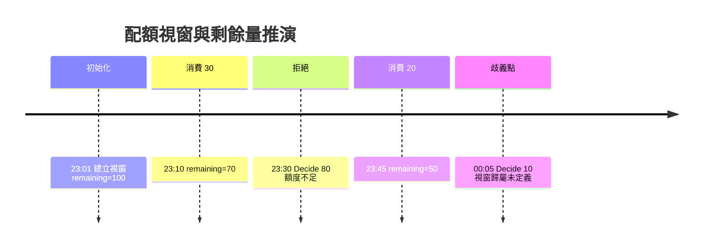
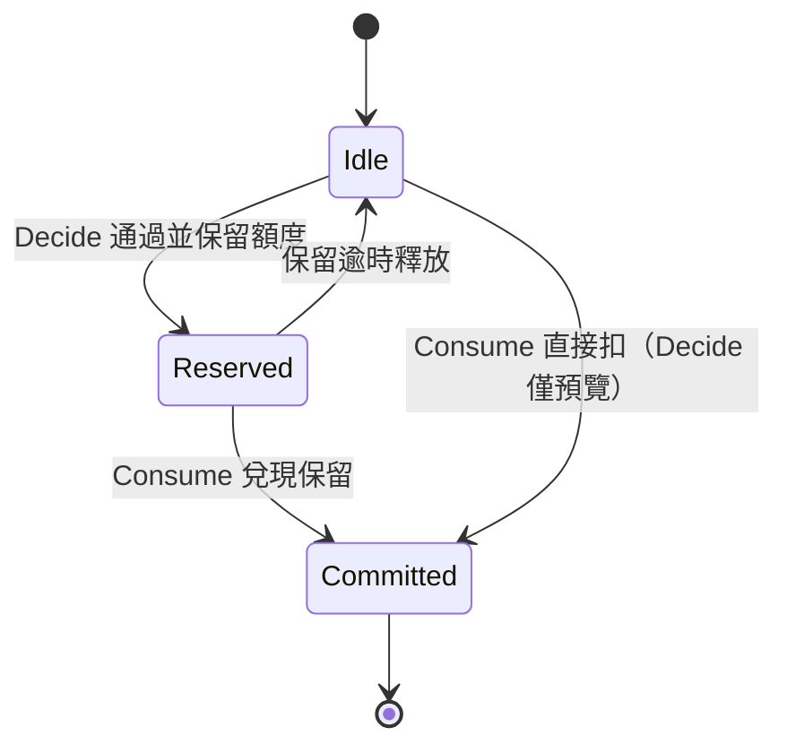
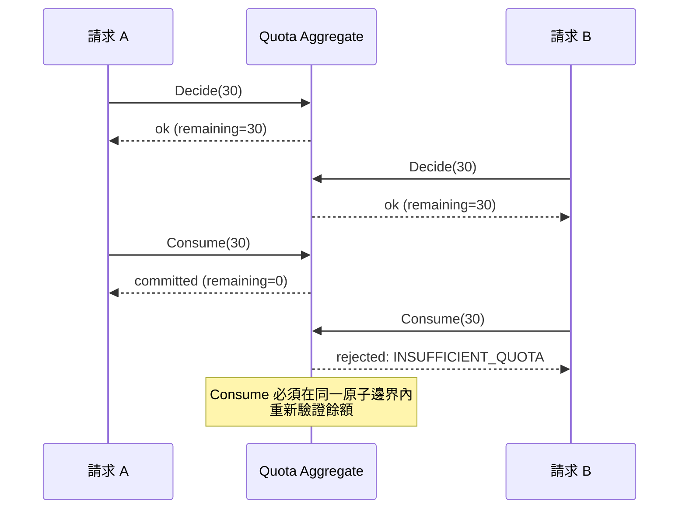

# 時間序列模擬：用時間軸推演狀態變化找出規格歧義

#timeline-simulation #specification-validation #state-modeling #concurrency #ai-workflow

## 這是什麼

時間序列模擬是把規格放到一條真實時間軸上逐格推演，觀察每個命令抵達時系統狀態如何改變、哪些欄位被寫入、剩餘值如何計算。它不是測試，也不是壓力測試，而是在寫任何一行實作之前，用一連串帶時間戳的事件逼問規格：「這一刻，系統到底該相信什麼？」

多數規格在靜態閱讀時看起來都完整。缺陷幾乎都藏在時間裡——兩個命令幾乎同時抵達、外部回呼比預期晚了三秒、一個視窗剛好在請求處理到一半時到期。這些情況在條列式需求裡看不出來，卻會在上線後變成資料錯亂與客訴。

## 核心結論

規格的歧義大多不是「規則寫錯」，而是「規則沒有規定時間順序下的行為」。只要能構造一條時間軸，讓同一份規格推導出兩種以上合理但不同的結果，就證明規格有洞。時間序列模擬的產出不是「通過」，而是一串必須回寫規格的問題。

AI 在這裡的角色是機械式展開者：給它一條事件序列，要它逐格列出狀態，並在任何需要猜測的地方停下來標記歧義。它不該替你決定「應該是哪種行為」，那是領域決策。

## 為什麼靜態檢查不夠

以一個配額（Quota）系統為例。規格寫著：

> 使用者每小時可用 100 單位。`Decide` 檢查是否足夠，`Consume` 實際扣除，視窗到期後重置。

這段話讀起來毫無問題。但它沒有回答的問題全部藏在時間裡：

- `Decide` 回報「足夠」之後、`Consume` 真正扣除之前，另一個請求也 `Decide` 了，兩者都以為自己搶得到最後 30 單位，該怎麼辦？
- 視窗「每小時」是從什麼時候起算？固定時鐘的整點，還是使用者第一次請求的時間？
- 一個請求在 `Decide` 通過後、`Consume` 前，視窗剛好到期，這次消費算舊視窗還是新視窗？

自然語言規格對這些問題保持沉默，而沉默會被實作者、被 AI、被不同的團隊成員各自用「常識」填補——填出三種不一樣的系統。時間序列模擬的價值就是把這種沉默變成明確的、帶編號的待決問題。

## 一條最小時間軸

先用單執行緒、無並行的最單純情況建立基準線。把每個事件寫成 `時間 | 命令 | 參數`，要求逐格輸出狀態：

```text
23:01  Init                  window=[23:01,00:01) remaining=100
23:10  Decide(30) → ok       remaining(預覽)=70
23:10  Consume(30)           remaining=70
23:30  Decide(80) → reject   remaining=70  (不足)
23:45  Consume(20)           remaining=50
00:05  Decide(10) → ?        視窗已過 23:01 起算的一小時
```

最後一行的問號就是規格缺口。`00:05` 這個請求落在哪個視窗，取決於「每小時」怎麼定義，而規格沒說。這一格逼出第一個待決問題：**視窗是滑動（相對第一次請求）還是固定（對齊時鐘整點）？**

用 Mermaid 把這條時間軸畫成狀態隨時間的變化，能讓領域人員一眼看出斷點：



## 把 Decide 與 Consume 的關係攤開

`Decide` 與 `Consume` 分兩步，本身就是一個需要規格明確化的決策。時間軸能逼出三種截然不同的語意，而它們對應完全不同的實作：



- **Decide 只是預覽**：`Decide` 不改變任何狀態，`Consume` 才是唯一真相來源。這種設計下，兩個並行請求可能都 `Decide` 通過，卻只有一個能 `Consume` 成功——需要在 `Consume` 這一步做原子檢查。
- **Decide 保留額度**：`Decide` 通過即扣住額度並設定保留逾時，`Consume` 兌現它。這解決了超賣，但引入「保留了卻沒消費」的懸空額度，需要規格定義釋放時機。
- **兩步合一**：根本不分兩步，只有一個原子 `Consume`。最簡單，但呼叫端無法「先問再做」。

規格若沒指定是哪一種，AI 生成的實作會在三者之間隨機漂移。時間序列模擬的作用是把這個選擇從「隱含」變成「必須明確回答」。

## 並行才是真正的考場

單執行緒基準線建好後，把同一時刻塞進兩個命令。這是最容易暴露規格漏洞的一步：

```text
剩餘 = 30

T0.000  請求A Decide(30) → ok
T0.001  請求B Decide(30) → ok      ← 兩者都看到 30，都通過
T0.002  請求A Consume(30)          → remaining=0
T0.003  請求B Consume(30)          → ？
```

`T0.003` 這一格是整份規格的試金石。如果採「Decide 只是預覽」語意，B 的 `Consume` 必須失敗，於是規格需要規定：`Consume` 要重新檢查、要用什麼並行控制（樂觀鎖版本號、資料庫唯一約束、`SELECT ... FOR UPDATE`）、失敗時回什麼錯誤碼。這些全都是規格層級的承諾，不是實作細節，因為它們決定了呼叫端會看到什麼。

用序列圖把競態畫出來，領域人員與工程師才會對「哪一步是原子的」達成共識：



## 把模擬變成可執行的東西

時間軸不該只停在白板上。把它寫成一個純函式的狀態機模擬器，讓每條時間軸變成可重播的資產。重點是模擬器只表達業務規則，不碰資料庫、不碰框架：

```php
final class QuotaModel
{
    /** @var array<string, int> windowKey => remaining */
    private array $remaining = [];

    public function __construct(
        private readonly int $limit,
        private readonly WindowPolicy $policy, // Fixed 或 Sliding，明確傳入
    ) {}

    public function decide(string $user, int $amount, DateTimeImmutable $at): Decision
    {
        $key = $this->policy->windowKey($user, $at);
        $remaining = $this->remaining[$key] ?? $this->limit;

        return $remaining >= $amount
            ? Decision::allow($remaining)
            : Decision::reject($remaining);
    }

    public function consume(string $user, int $amount, DateTimeImmutable $at): Decision
    {
        $key = $this->policy->windowKey($user, $at);
        $remaining = $this->remaining[$key] ?? $this->limit;

        // 關鍵：Consume 重新驗證，不信任先前的 Decide
        if ($remaining < $amount) {
            return Decision::reject($remaining);
        }

        $this->remaining[$key] = $remaining - $amount;
        return Decision::allow($this->remaining[$key]);
    }
}
```

`WindowPolicy` 被當成建構子參數明確傳入，正是因為時間軸模擬逼出了「固定 vs 滑動」這個必須先決定的問題。把它變成參數，就等於承認規格必須回答它，而不是讓實作偷偷選一種。

有了這個模型，先前那條會出問題的時間軸就能寫成一個守住規則的檢查：

```php
it('固定視窗下跨整點的消費歸入新視窗', function () {
    $model = new QuotaModel(limit: 100, policy: new FixedHourlyWindow());

    $model->consume('u1', 30, at('23:10'));
    $model->consume('u1', 20, at('23:45'));

    // 00:05 屬於新的整點視窗，餘額應重置為 100
    $decision = $model->decide('u1', 90, at('00:05'));

    expect($decision->allowed())->toBeTrue()
        ->and($decision->remaining())->toBe(100);
})->group('specification');
```

如果領域人員原本以為是滑動視窗，這個測試會逼他們把預期講清楚——這正是模擬的目的：**讓歧義以測試失敗的形式浮現，而不是以線上事故的形式浮現。**

## 引導 AI 展開時間軸的 Prompt

不要問 AI「這個規格有沒有問題」，那會得到空泛的正面回覆。要給它一條具體時間軸，命令它逐格輸出並在猜測處停下：

```text
你是規格模擬器。以下是配額系統規格與一條事件時間軸。
逐格輸出每個事件後的狀態：window、remaining、被寫入的欄位。
規則：
1. 只能使用規格中明確寫出的規則。
2. 任何一格若需要你猜測（視窗歸屬、並行順序、保留是否釋放），
   停下並標記為 OPEN QUESTION，附上你會如何用不同假設得到不同結果。
3. 不要自行採用任何電商或限流慣例補齊規格。
4. 對每個 OPEN QUESTION，給出一條能區分兩種假設的最小時間軸。

時間軸：
23:01 Init
23:10 Consume(30)
23:45 Consume(20)
00:05 Decide(10)
（並行）T0 Decide(30) 與 Decide(30) 同時，remaining=30
```

## 如何讀 AI 的回應

AI 通常會很順地產出一張狀態表，這正是危險所在——**流暢不代表正確**。檢查它的方式是攻擊它的每個「順理成章」：

- 它是否在某一格悄悄選了固定或滑動視窗卻沒標記？若有，那格就是它替你做了本該由人做的決策。
- 並行那兩格，它是否假設了某種順序（例如 A 一定先於 B）？真實系統沒有這個保證，這裡必須是 OPEN QUESTION。
- 它產生的 OPEN QUESTION 是否附了可區分假設的反例時間軸？只有問題沒有反例，代表它沒真的推演，只是套話。

好的 AI 回應應該讀起來像一個謹慎的工程師：狀態表清楚，但在三到四個地方明確停下說「這裡規格沒定義，若是 X 則結果是這樣，若是 Y 則是那樣」。把這些回寫成規格的 `open_questions`，由領域人員裁決，再更新模型與測試。

## 常見錯誤

- **只模擬快樂路徑**：只推「額度足夠、單一請求、視窗內」的時間軸，等於沒模擬。價值全在邊界：剛好用完、剛好跨視窗、剛好並行。
- **把並行畫成有順序**：一旦在時間軸上假設了「A 先 B 後」，就掩蓋了真正的競態。並行事件要標為同時，並列舉所有交錯順序。
- **模擬器碰資料庫**：一旦模型去讀寫真實資料表，它就同時在驗證規格與驗證基礎設施，兩者混在一起就無法定位問題。模型必須是純函式。
- **把模擬結果當實作**：模型的目的是暴露規格歧義，不是拿去上線。它刻意省略持久化、重試、交易，別把它誤當領域層。
- **AI 猜了卻沒標記，你也沒抓**：最隱蔽的錯誤。AI 平順地填了視窗語意，你順著讀過去，歧義就這樣被實作繼承。每一格都要問：這是規格說的，還是 AI 補的？

## Checklist

- 是否為每條核心規則建立了單執行緒基準時間軸？
- 是否至少有一條時間軸跨越視窗／狀態邊界？
- 是否有並行時間軸，且並行事件標為同時、列出所有交錯？
- `Decide`／`Consume` 的語意（預覽／保留／合一）是否已明確選定並寫回規格？
- 視窗策略（固定／滑動）是否已明確化為參數而非隱含假設？
- 每個 OPEN QUESTION 是否都附了可區分假設的反例時間軸？
- 模擬器是否為純函式、不碰資料庫與框架？
- 模擬暴露的歧義是否已回寫 `open_questions` 並指派裁決者？

## 最佳實務

把時間序列模擬放在規格流程的中段：在資料模型收斂之後、產生可執行驗證之前。太早做，還沒有足夠結構可推演；太晚做，錯誤已寫進實作。

維護一個「黃金時間軸」集合，隨規格演進持續重播。每當規格改一條規則，先問：哪幾條黃金時間軸的結果會變？如果一條規則的改動不影響任何時間軸，要嘛這條規則沒被覆蓋，要嘛它其實不重要。這個集合最終會自然長成第 03 篇談的可執行規格與追蹤矩陣的核心。

## 延伸閱讀

- [規格即程式](./01-規格即程式：用型別、狀態機與不變量定義需求.md)——時間軸推演的每一格，本質上是在檢查狀態機轉移與不變量。
- [驗證與追蹤](./03-驗證與追蹤：在開發前發現規格錯誤.md)——黃金時間軸最終併入追蹤矩陣與 property-based testing。
- [配額系統完整範例](./07-配額系統完整範例：Decide、Consume、Refund、Reset-與-Ledger.md)——本文的 Quota 領域在該篇有完整的 Laravel 分層實作。

更新日期：2026-07-22
