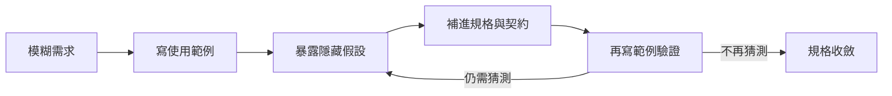
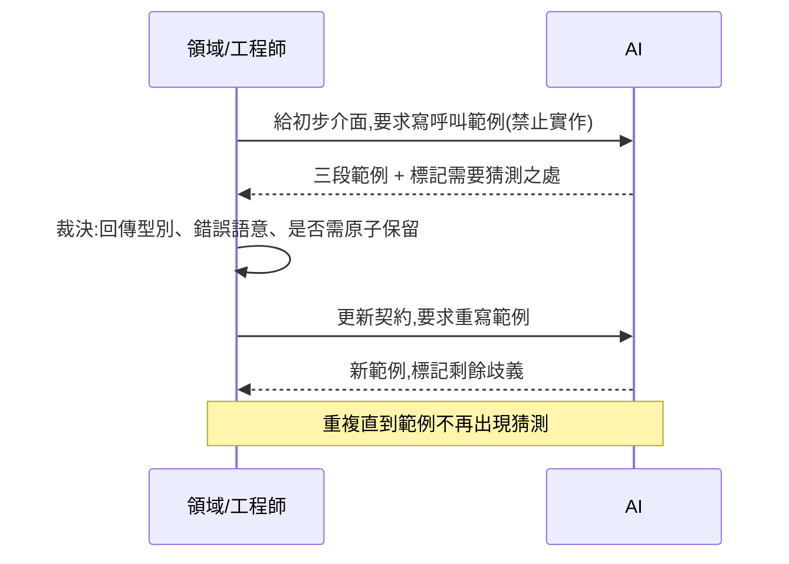

# 範例驅動收斂：先寫使用範例，再回頭補規格

#example-driven #api-design #specification-convergence #ai-workflow #contract-first

## 這是什麼

範例驅動收斂是一種刻意顛倒順序的規格方法：不先寫規格文件、也不先設計資料庫，而是先寫出「呼叫端會怎麼用這個東西」的具體範例，再從範例反推規格。範例是最誠實的規格——它無法含糊，因為每個參數、每個回傳、每個錯誤都必須寫出具體的值。

多數團隊的順序相反：先寫一份充滿「系統應該」「使用者可以」的需求文件，再直接跳去建資料表。這條路徑跳過了最關鍵的一步——沒有人先確認這個 API 用起來到底合不合理。等到寫測試時才發現介面難用，往往已經有一堆程式依賴它了。

## 核心結論

一個介面好不好用，只有寫出它的使用範例才知道。範例會逼出所有規格文件容易略過的問題：呼叫者需要事先知道什麼、回傳夠不夠讓他做下一步、失敗時他能不能分辨原因並重試。先讓 AI 寫範例、而不是寫實作，能在零成本的階段把介面的難用之處攤在眼前。

順序是關鍵：**範例 → 發現隱藏假設 → 補規格 → 再寫範例驗證**。每一輪都讓範例更具體、規格更明確，直到範例裡不再出現任何「這裡我得猜」的地方。

## 為什麼從範例開始

規格文件有個結構性缺陷：它用抽象語言描述抽象規則，而抽象語言可以在不自相矛盾的情況下保持含糊。「系統應該在額度不足時拒絕請求」這句話讀起來完整，但它沒被迫回答「拒絕」長什麼樣子——是丟例外、回 null、還是回一個帶錯誤碼的物件?呼叫者怎麼知道還差多少?

範例沒有這種奢侈。要寫出一行 `$result = $quota->consume($userId, 30);`，你就必須決定 `$result` 是什麼型別、裡面有什麼、失敗時它如何表達。含糊在範例裡無處藏身。這就是為什麼範例是比散文更強的規格——它是可以被閱讀、被質疑、被執行的契約草稿。

用一張圖表示這條顛倒的路徑：



## 第一步：要求 AI 寫呼叫範例而非實作

給 AI 一個初步介面，明確禁止它實作，只要它示範「呼叫端會怎麼用」：

```text
以下是配額服務的初步介面。
不要實作。不要碰資料庫、Controller、框架。
請寫出三段呼叫端程式碼：
1. 正常情況：使用者消費額度成功。
2. 額度不足：呼叫端需要知道還差多少並決定是否降級。
3. 需要先確認再執行：呼叫端想先問「夠不夠」再決定要不要真的扣。
每段都要寫出具體的變數、型別與呼叫端如何處理回傳。
若介面不足以寫出某段範例，指出缺什麼，不要自行補齊。
```

AI 可能回傳這樣的範例，而它立刻暴露了介面的第一個問題：

```php
// 正常情況
$quota->consume($userId, 30);
// ↑ 沒有回傳值。呼叫端無從得知是否成功、剩多少。

// 額度不足——呼叫端想降級
try {
    $quota->consume($userId, 30);
} catch (InsufficientQuotaException $e) {
    // e 裡有沒有「還差多少」？規格沒說。
    $this->serveDegraded();
}

// 先確認再執行
if ($quota->hasEnough($userId, 30)) {
    $quota->consume($userId, 30);
    // ↑ 這中間如果別的請求把額度用掉了呢？
}
```

三段範例，三個規格缺口，全部在寫任何實作之前就浮現。

## 第二步：從範例反推隱藏假設

範例寫出來後，逐段攻擊，把每個「呼叫端得猜」的地方變成明確問題：

- **第一段**暴露：`consume` 該不該回傳結果?如果回,回什麼?一個 `ConsumeResult`(帶剩餘量),還是只回 bool?這決定了呼叫端能做什麼。
- **第二段**暴露：失敗用例外還是回傳值表達?例外裡帶不帶「差多少」?若呼叫端要用這個數字做降級決策,它就不是可有可無的除錯資訊,而是契約的一部分。
- **第三段**暴露一個更深的問題:`hasEnough` 然後 `consume` 是兩次呼叫,中間有時間差(這正是第 05 篇時間序列模擬的核心)。範例逼出「要不要提供一個原子的『確認並保留』操作」這個設計決策。

這些問題不是實作細節,它們是契約決策——決定了呼叫端的程式長什麼樣。範例的作用就是讓這些決策在最便宜的時候被看見。

## 第三步:把答案回寫成契約

領域人員裁決之後,把結論回寫成明確的介面與 DTO,不是回寫成散文。假設決定:`consume` 回傳結果物件、失敗用結果而非例外表達、提供原子的保留操作:

```php
interface QuotaService
{
    /** 原子消費;結果永遠帶剩餘量,呼叫端不需再查一次。 */
    public function consume(UserId $user, int $amount): ConsumeResult;

    /** 保留額度並取得一張憑證,之後用 commit 兌現或讓它逾時釋放。 */
    public function reserve(UserId $user, int $amount): Reservation;
}

final readonly class ConsumeResult
{
    public function __construct(
        public bool $allowed,
        public int $remaining,
        public ?QuotaError $error, // allowed=false 時說明原因,含 shortfall
    ) {}
}
```

注意 `hasEnough` 消失了。範例第三段暴露的「查了再做會有時間差」問題,讓它演化成 `reserve` + `commit` 的原子保留模式。這是範例驅動最有價值的產出:**它不只補了規格的洞,還改掉了一個會誘導呼叫端寫出競態的介面。**

## 第四步:再寫範例驗證收斂

契約改好後,重寫一次範例。如果這一輪範例裡不再出現任何「這裡我得猜」的註解,就是收斂的訊號:

```php
// 正常:結果自帶剩餘量,不需二次查詢
$result = $quota->consume($userId, 30);
if (! $result->allowed) {
    $this->serveDegraded(shortfall: $result->error->shortfall);
}

// 先確認再執行:用原子保留,沒有時間差
$reservation = $quota->reserve($userId, 30);
if ($reservation->granted()) {
    $this->render();
    $reservation->commit();
} else {
    $reservation->release();
}
```

把兩輪範例並排,收斂就變得可見:第一輪處處是問號,第二輪處處是明確的分支。這個差異本身就是給領域人員與 reviewer 看的最佳證據——它證明介面從「能編譯但難用」變成了「用起來就是對的」。

## AI 在這個流程裡的責任邊界



AI 負責:快速產生範例、誠實標記需要猜測的地方、在契約更新後重寫範例、提出多種介面形狀供比較。AI 不負責:決定回傳型別該是什麼、決定失敗語意、決定是否值得為原子性增加一個 `reserve` 操作。這些是取捨,取捨屬於人。

一個實用的判準:如果 AI 在寫範例時「沒有標記任何猜測就順利寫完了」,要提高警覺——不是介面完美,而是它悄悄替你做了決定。好的範例產出應該伴隨一串「這裡我假設了 X,但規格沒說」。

## 常見錯誤

- **讓 AI 直接實作而非先寫範例**:一旦有了實作,介面就被實作方便性綁架,而不是被呼叫端需求塑造。範例先行才能讓呼叫端的觀點主導設計。
- **範例只寫快樂路徑**:三段裡最有價值的是失敗與「先確認再執行」那兩段,它們才會逼出錯誤語意與原子性問題。只寫成功範例等於沒收斂。
- **把範例當文件而非契約草稿**:範例寫完就存檔、不回寫成介面與 DTO,等於讓收斂成果停留在聊天記錄,repository 裡的規格沒有改變(見第 02 篇談的「只有聊天改變不算工程資產」)。
- **收斂太早**:第一輪範例能寫出來就以為完成。真正的收斂是「重寫範例時不再需要猜測」,通常要三輪以上。
- **用範例掩蓋競態**:`hasEnough` 然後 `consume` 這種兩步範例若不追問中間的時間差,範例反而會把一個競態設計正當化。範例要搭配時間序列模擬一起看。

## Checklist

- 是否先寫了呼叫端範例,而不是先寫實作或資料表?
- 範例是否涵蓋正常、失敗、以及「先確認再執行」三類情境?
- 每段範例裡「呼叫端需要猜測」的地方是否都被標記為待決問題?
- 失敗情境的回傳是否帶了呼叫端做決策所需的資訊(如 shortfall)?
- 兩步操作(查詢後動作)是否檢查過中間的時間差,必要時演化成原子操作?
- 裁決結論是否回寫成介面與 DTO,而非停在散文或聊天?
- 重寫的第二輪範例是否已不再出現猜測?
- 收斂前後的兩輪範例是否並排保留,作為介面改善的證據?

## 最佳實務

把範例驅動放在流程最前段:在寫任何規格散文與資料模型之前。它產出的介面與 DTO 正是第 01 篇「規格即程式」裡契約與型別的來源,也是第 04、07 篇完整範例的起點。

維護一份「範例即文件」的檔案,讓最終收斂的呼叫範例直接成為 API 使用說明。這有個額外好處:當介面日後要演進,先改範例、看範例變醜的程度,就能預估這次變更對呼叫端的破壞性——範例是最早的相容性警報。

## 延伸閱讀

- [規格即程式](note.html?slug=ai/ai-specification-engineering/01-spec-as-code)——範例收斂出的介面與 DTO,在該篇被形式化為契約與不變量。
- [AI 協作收斂](note.html?slug=ai/ai-specification-engineering/02-model-convergence)——範例收斂介面,資料模型收斂持久化,兩者互為表裡。
- [時間序列模擬](note.html?slug=ai/ai-specification-engineering/05-timeline-simulation)——範例中的「先確認再執行」為何危險,在該篇有完整的並行推演。

更新日期：2026-07-22
