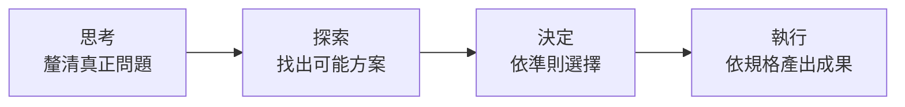
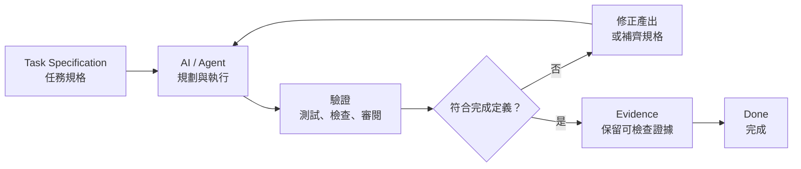

# 你不是不會寫 Prompt，是不會定義任務：AI 任務規格重點摘要

#ai #agent #prompt #task-specification #knowledge

## 這是什麼

這篇整理 YouTube 影片〈你不是不會寫 Prompt，是不會定義任務〉的核心觀念，並把內容改寫成可實際套用的 AI／Agent 任務規格筆記。

影片的重點不是提供一套「神奇提示詞」，而是提醒我們：**AI 產出不好，常常不是 Prompt 寫得不夠漂亮，而是任務本身還沒有被定義清楚。**

當模型與 Agent 已經能自行讀取資料、規劃步驟、操作工具及反覆修正時，人更重要的工作是說清楚目的、背景、可用素材、不可跨越的邊界，以及什麼證據足以證明任務完成。

## 核心結論

- Prompt 寫作處理的是「怎麼說」，Task Specification（任務規格）處理的是「究竟要完成什麼」。
- 模型能力愈強，逐步遙控它的價值愈低；清楚交代目的、限制與驗收條件的價值愈高。
- 交辦之前，先確認任務正處於「思考、探索、決定、執行」哪一個階段。
- 只有進入執行階段後，才適合用完整規格要求 AI／Agent 產出成果。
- 一份可執行的任務規格至少要包含 Goal、Context、Materials、Boundaries、Definition of Done 五個欄位。
- 「完成」不能只靠 AI 自己宣告，而要經過驗證並留下可檢查的 Evidence（證據）。

## Prompt Engineering 為什麼不再是全部

早期模型能力較弱，使用者往往需要指定角色、拆解每一步、提供輸出格式、補上多個範例，並反覆提醒模型不要猜測。這些 Prompt 基本功仍然有用，但它們無法補救一個根本沒有想清楚的任務。

面對能力較完整的 AI／Agent，更有效的交辦方式比較像是在管理一位資深協作者：

- 說明為什麼要做，而不只是要求做某個動作。
- 提供會影響判斷的背景，而不是讓 AI 套用通用假設。
- 指定可以信任的素材與證據來源。
- 清楚列出不能做的事與不可超出的範圍。
- 定義什麼結果才算完成，以及要如何證明。

因此，真正拉開成果差距的能力，逐漸從 Prompt 技巧轉向 Task Definition／Task Specification，也就是把模糊需求整理成可執行、可驗證的工作定義。

## 動手前先判斷四個階段



### 1. 思考：問題到底是什麼

此時連要解決的問題都還不夠清楚，不應急著要求 AI 實作。

適合請 AI：

- 反問關鍵問題。
- 找出隱藏假設與利害關係人。
- 區分表面需求與真正目的。
- 指出目前缺少哪些資訊。

範例指令：

> 先不要提出方案或開始實作。請透過提問協助我釐清真正要解決的問題、使用者、成功條件與已知限制。

### 2. 探索：有哪些可行路線

問題已經清楚，但還不知道應該採用哪一種解法。

適合請 AI：

- 列出多個候選方案。
- 比較成本、風險、維護性與適用情境。
- 找出未知事項及需要先驗證的假設。
- 避免過早收斂到第一個看似合理的答案。

範例指令：

> 請提出三種可行方案，說明各自的優缺點、風險、前提與適用情境；目前先不要選定或實作。

### 3. 決定：用什麼準則選擇

候選方案已經存在，需要依明確標準做出選擇。

適合請 AI：

- 建立比較矩陣。
- 依優先順序評估方案。
- 說明取捨與剩餘風險。
- 指出哪些選擇仍需由人承擔責任。

範例指令：

> 請依安全性、建置成本、維護難度與可逆性評估候選方案，提出建議並說明取捨；不要自行改變評估準則。

### 4. 執行：依已確認的規格完成工作

問題、方案與重要決策都已確定，才進入執行。

此時應提供完整的 Task Specification，讓 AI／Agent 可以在明確邊界內規劃、操作、驗證與修正。

範例指令：

> 依下列已確認的任務規格實作。若發現規格互相衝突、必要素材缺漏或完成條件無法驗證，請停止並回報，不要自行擴大範圍。

## 常見錯位：人在思考，卻叫 AI 執行

許多失敗不是模型能力不足，而是階段錯位：需求還停留在思考或探索階段，指令卻直接要求 AI 產出最終答案、寫程式或做完整企劃。

AI 通常仍會嘗試回答，於是自行補上使用者沒有決定的目標、假設與限制。結果可能格式完整、篇幅很長，卻沒有真正解決問題。

判斷原則很簡單：

- 問題還不清楚：先思考。
- 解法還不清楚：先探索。
- 選擇還沒做：先決定。
- 方向與驗收方式都清楚：才執行。

## 執行任務的五個欄位

### Goal：目標

Goal 說明任務希望造成什麼結果，以及為什麼值得做。

不要只寫動作：

> 做一個 Refresh Token 功能。

應補上目的：

> 讓 Access Token 維持短效以縮小外洩風險，同時讓合法使用者不必頻繁重新登入。

目標能幫助 Agent 在遇到細節選擇時，判斷哪一種作法更接近真正目的。

### Context：背景

Context 是會影響判斷的必要背景，不是把所有歷史資料一股腦塞給 AI。

例如：

- 現有系統與技術環境。
- 目標使用者與使用情境。
- 已做出的架構或產品決策。
- 目前遇到的問題與已知原因。
- 與既有流程、介面或團隊規範的關係。

背景不足時，AI 只能套用通用假設；背景過多時，重要訊息又容易被雜訊淹沒。

### Materials：素材

Materials 定義 AI 可以依據哪些資料工作，也就是任務的證據範圍。

例如：

- 既有程式碼與設定檔。
- 資料庫 schema、API contract 或設計文件。
- 訪談紀錄、研究資料、數據或參考範例。
- 官方規格、法規或團隊規範。

也可以加上來源規則：

> 找不到可靠證據時標示為「未知」，不要自行補造事實。

### Boundaries：邊界

Boundaries 說明不可跨越的限制與明確不做的項目。

例如：

- 不改動既有公開 API。
- 不導入新的第三方服務。
- 不處理本次範圍以外的重構。
- 不把權杖、個人資料或敏感資訊寫入紀錄。
- 未經確認不得執行不可逆操作。

邊界的作用不是束縛 AI，而是避免它為了完成表面目標，順手做出不被允許的改動。

### Definition of Done：完成定義

Definition of Done 要同時回答兩件事：

1. **停在哪裡**：本次要交付哪些成果，哪些不在範圍內。
2. **什麼算好**：成果必須符合哪些品質標準與驗收條件。

例如：

- 指定的功能與錯誤路徑都有測試。
- 既有測試仍全部通過。
- API contract 沒有非預期變更。
- 文件已更新，並提供實際驗證結果。
- 所有結論都能回溯到素材或產生的證據。

「寫完」「看起來可以」或「AI 說完成了」都不是可驗證的完成定義。

## 從任務規格走到真正完成

五欄位 brief 定義了如何交辦；要在實務上把成果可靠地交付，還需要一條包含驗證與證據的閉環：



### Task Specification

把 Goal、Context、Materials、Boundaries、Definition of Done 寫成可交付的規格，並先消除明顯衝突與未知事項。

### AI／Agent

AI／Agent 在規格邊界內自行規劃及執行。遇到關鍵缺漏、衝突或需要擴大權限時，應停止並要求確認，而不是默默猜測。

### 驗證

用與任務相稱的方法檢查成果，例如自動測試、靜態檢查、資料比對、人工審閱、瀏覽器操作或實際情境演練。

驗證的目的不是證明 AI 很努力，而是判斷成果是否真的符合 Definition of Done。

### Evidence

保存可被第三方檢查的證據，例如：

- 測試結果與檢查紀錄。
- 變更差異與版本編號。
- 畫面截圖、實際網址或操作結果。
- 資料來源與引用位置。
- 未解風險、例外及人工確認紀錄。

### Done

只有在完成條件全部成立，且證據足以支撐這個判斷時，任務才算 Done。若驗證失敗，應回到產出或規格修正，而不是降低標準或省略證據。

## 可直接套用的任務規格範本

```markdown
# 任務名稱

## Goal
- 要達成的結果：
- 為什麼要做：
- 對誰產生價值：

## Context
- 現況與問題：
- 技術／業務環境：
- 已確認的決策：
- 仍未知的事項：

## Materials
- 必須參考的檔案、資料或來源：
- 可信任來源的優先順序：
- 找不到證據時的處理方式：

## Boundaries
- 可以修改的範圍：
- 不可修改或不可執行的事項：
- 權限、安全與隱私限制：

## Definition of Done
- 必須交付的成果：
- 品質與驗收標準：
- 必須執行的驗證：
- 必須保留的 Evidence：
```

## 最後的自我檢查

交辦給 AI／Agent 前，先問：

- 我現在是在思考、探索、決定，還是執行階段？
- Goal 是目的，還是只有一個動作？
- Context 是否只保留會影響判斷的背景？
- Materials 是否清楚指定可依據的來源？
- Boundaries 是否列出不能做的事？
- Definition of Done 是否能被客觀驗證？
- 最後要留下什麼 Evidence，才能讓別人確認成果？

如果這些問題答不出來，最好的下一個 Prompt 通常不是「直接幫我做」，而是請 AI 協助把任務定義補完整。

## 來源與整理限制

- 原始影片：[你不是不會寫 Prompt，是不會定義任務](https://www.youtube.com/watch?v=KNP9Mr1rUQY)
- 本文是影片主題的重點式整理，不是逐字稿。
- 「Task Specification → AI／Agent → 驗證 → Evidence → Done」是依影片的任務定義觀念整理出的實務閉環，用來強化可驗證交付。
