# Refresh Token 問題處理與架構設計指南

#authentication #refresh-token #session #security #backend #knowledge

## 這是什麼

整理 Refresh Token 在 Web 系統中真正容易出錯的地方，重點放在 **Session 狀態一致性、併發、Rotation、跨分頁、SSR、Cookie、Logout 與生命週期**。本文不把 Refresh 視為單一 API 行為，而是視為 Authentication Session 的狀態轉換。

## 核心結論

- Refresh Token 不應成為 JavaScript 可直接讀取的長期 credential；Web 情境優先使用 HttpOnly Cookie 或 Server-side Session。
- Refresh 必須集中到單一責任邊界；同一 Session 的正常 Refresh 要避免併發，Server 端 Rotation 必須保證 atomic consume 與唯一 successor。
- 多分頁、SSR、多 Server Instance、WebSocket / SSE 都會擴大 Refresh 的協調範圍；Client lock 只能降低競爭，不能取代 Server 正確性。
- Logout 一旦成立，任何較早啟動的 Refresh 都不得重新建立 authenticated Session。
- 在導入 Access Token + Refresh Token 前，先回答：**系統哪個具體需求是 Server-side Session 無法完成的？**

---

## 0. 共同模型：Refresh 是 Session State Transition

Refresh Token 不只是「換一個新的 Access Token」。一次 Refresh 實際上是在修改整個 Authentication Session：

```text
Generation 10

Access Token  = A1
Refresh Token = R1

        │ Refresh
        ▼

Generation 11

Access Token  = A2
Refresh Token = R2
```

因此 Refresh 的責任應集中，而不是散落在 HTTP client、WebSocket、middleware、component、route handler 裡。

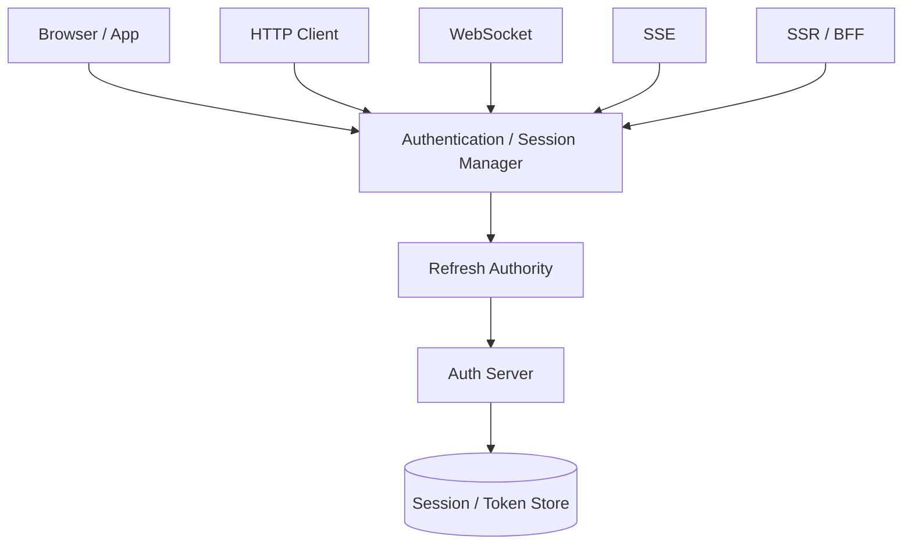

核心原則：

1. Refresh Token 不應散落在各層。
2. Refresh 必須有明確的唯一責任邊界。
3. Client 端的 lock 只能降低競爭，Server 端 atomicity 才是最後正確性防線。
4. Logout、Rotation、Retry、SSR 都應被當成 Session 狀態轉換問題。

---

## 1. Refresh Token 儲存安全

### 問題

若把 Refresh Token 放在 `localStorage`：

```js
localStorage.setItem('refresh_token', refreshToken)
```

只要頁面發生 XSS，惡意 JavaScript 就能直接讀取：

```js
localStorage.getItem('refresh_token')
```

Refresh Token 通常有效期較長，且可以持續換取新的 Access Token，因此它是比短效 Access Token 更高價值的長期 credential。

### 解法

Web 情境優先使用：

```text
HttpOnly Cookie
+
Secure
+
適當 SameSite
+
最小 Domain / Path scope
```

例如：

```http
Set-Cookie: refresh_token=...;
HttpOnly;
Secure;
SameSite=Lax;
Path=/auth/refresh
```

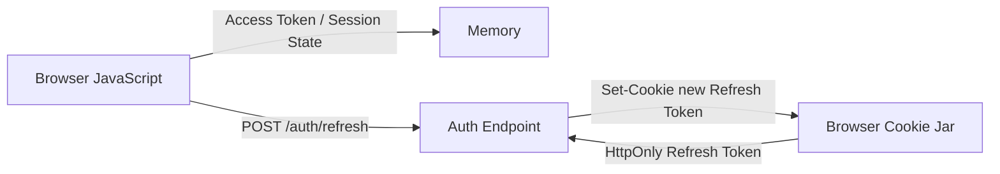

`HttpOnly` 的作用是避免 JavaScript 直接讀取 Refresh Token，本身不是完整的 XSS 防護。XSS 仍可能在使用者的 Browser 中呼叫 API、觸發 Refresh 或執行使用者有權限的操作。

### 核心 invariant

```text
Refresh Token
不應成為 JavaScript 可直接讀取的長期 credential
```

---

## 2. 單一 Runtime 的 Refresh 併發控制

### 問題

同一個 Tab 中，多個非同步工作可能同時判斷需要 Refresh：

```text
Task A ─┐
Task B ─┼─→ 都認為需要 Refresh
Task C ─┤
Task D ─┘
```

若各自執行：

```text
A → refresh(R1)
B → refresh(R1)
C → refresh(R1)
D → refresh(R1)
```

會產生多個 Refresh response、不同回傳順序、狀態覆寫與 Refresh storm。

### 解法：Single-flight

同一 JavaScript runtime 中，同時間只允許一個 Refresh operation：

```js
let refreshPromise = null

function ensureFreshSession() {
    if (refreshPromise) {
        return refreshPromise
    }

    refreshPromise = doRefresh()
        .finally(() => {
            refreshPromise = null
        })

    return refreshPromise
}
```

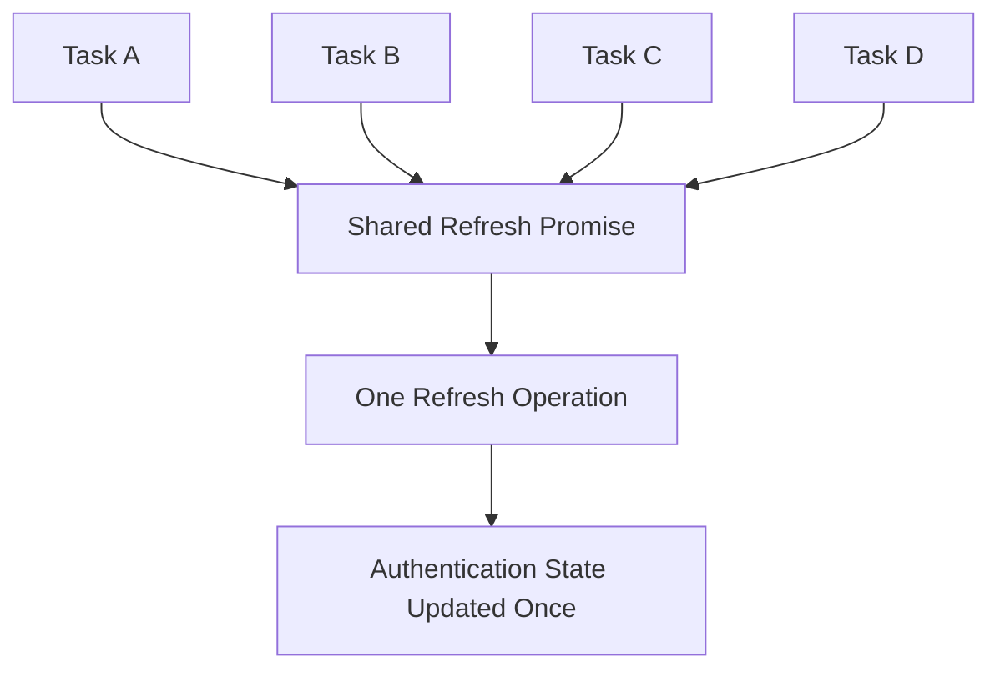

重點不是把多個 Refresh 排隊，而是讓所有同時發生的 Refresh 需求 **join 同一個 operation**。

Refresh Manager 應唯一更新 Authentication State；等待中的工作只接收成功或失敗結果，不應各自再次更新 Token。

Refresh 失敗也要共享，不能讓每個 waiter 在 catch 後各自重新啟動 Refresh。

### 核心 invariant

```text
同一 Session
+
同一 JavaScript runtime
+
同一時間

active refresh operation <= 1
```

---

## 3. Refresh Token Rotation 與重試安全

### 問題一：Rotation 不能分叉

正常 Rotation：

```text
R1 → R2
```

如果 Server 沒有原子性，兩個 request 可能都先判斷 R1 有效，再分別產生 R2、R3：

```text
      R1
     /  \
   R2    R3
```

這會讓 Token Family 分叉。

### 解法：Atomic Consume + Unique Successor

每顆 Refresh Token 必須：

```text
VALID
↓ atomic consume
USED
↓
產生唯一 successor
```

資料庫概念：

```sql
UPDATE refresh_tokens
SET
    consumed_at = NOW(),
    replaced_by = :new_token_id
WHERE
    id = :old_token_id
    AND consumed_at IS NULL
    AND revoked_at IS NULL;
```

必須確認：

```text
affected rows == 1
```

只有一個 request 能成功消耗 R1。

### Token Family

不能只存「目前 Refresh Token」。至少應能追蹤：

```text
token_id
session_id / family_id
token_digest
parent_id
replaced_by
issued_at
expires_at
consumed_at
revoked_at
```

Refresh Token 在資料庫優先儲存雜湊摘要，不存明文。

```text
Session S1

R1
↓
R2
↓
R3
↓
R4
```

### Reuse Detection 與合法 Retry

R1 已經被消耗後再次出現，可能代表：

- Refresh response 遺失後的合法 retry。
- 多分頁競爭。
- Client bug。
- 攻擊者取得舊 R1 後重放。

所以：

```text
R1 已 consumed
≠
一定是攻擊
```

### Refresh 成功，但 Response 遺失

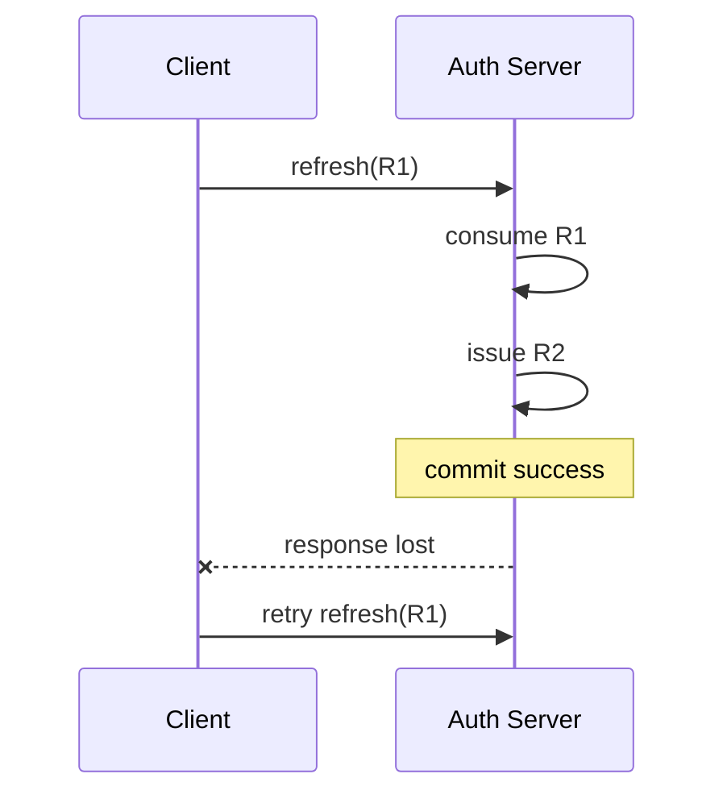

Server：

```text
R1 = USED
R2 = VALID
```

Client 卻仍只有 R1。這是正常可能發生的 distributed failure。

因此 Rotation 要設計成 retry-safe：如果短時間內再次看到已消耗的 R1，可以依 Token Family、successor、時間與 policy 判斷是否為同一次 Refresh 的合法 retry，而不是再產生 R3，也不是一律撤銷整個 Session。

### 核心 invariant

```text
同一 Refresh Token
consume 次數 <= 1
```

```text
同一 Refresh Token
successor 數量 <= 1
```

```text
Refresh response lost
≠
必然要求使用者重新登入
```

---

## 4. 多分頁 Refresh 協調

### 問題

`refreshPromise` 只存在單一 Tab：

```text
Tab A
└─ refreshPromise A

Tab B
└─ refreshPromise B
```

因此仍可能：

```text
Tab A → refresh(R1)
Tab B → refresh(R1)
```

### 解法：Cross-tab Lock + State Propagation

Lock 用來決定「誰可以 Refresh」；Broadcast 用來通知「Refresh 發生了什麼」。兩者責任不同。

可以用 `navigator.locks` 做跨 Tab mutual exclusion：

```js
await navigator.locks.request('auth-refresh', async () => {
    if (!needsRefresh()) {
        return
    }

    await ensureFreshSession()
})
```

取得 lock 後必須再次確認是否仍需要 Refresh，因為等待期間其他 Tab 可能已經完成。

狀態通知可用 `BroadcastChannel`：

```js
const channel = new BroadcastChannel('auth')

channel.postMessage({
    type: 'AUTH_GENERATION_CHANGED',
    generation: 12,
})
```

```text
Lock
→ 誰可以 Refresh

Broadcast
→ Refresh 發生了什麼
```

### Access Token 與 Refresh Token scope 不同

若 Refresh Token 在 HttpOnly Cookie，而 Access Token 在各 Tab memory：

```text
Tab A：A2
Tab B：A1
```

Refresh 成功後，Tab B 不會自動取得 A2，因此必須另外定義：

- 是否 Broadcast Access Token。
- 是否只 Broadcast Authentication Generation。
- 是否改成 BFF / Server-side Session，讓 Browser 不必自行同步 Access Token。

Broadcast 只能是通知，不應是唯一 source of truth。背景 Tab 可能休眠或錯過訊息，恢復時應可重新確認 Session / Auth Generation。

不建議用 `localStorage` 自己刻 lock，否則又要處理 race、crash、TTL、owner、lease 等分散式鎖問題。

### 核心 invariant

```text
同一 Browser Session
所有 Tab 合計
active refresh operation <= 1
```

以及：

```text
Refresh 完成後
所有仍活著的 Tab
最終必須收斂到同一 Authentication Generation
```

---

## 5. Refresh 與 WebSocket / SSE 長連線同步

### 問題

HTTP Refresh 後：

```text
A1 → A2
```

但既有 WebSocket / SSE 不會自動重新認證：

```text
HTTP
→ A2

WebSocket
→ 仍是建立連線時的 A1 狀態
```

### 原則：Transport 不擁有 Refresh 權限

錯誤：

```text
HTTP Client
└─ 自己 Refresh

WebSocket
└─ 自己 Refresh

SSE
└─ 自己 Refresh
```

正確：

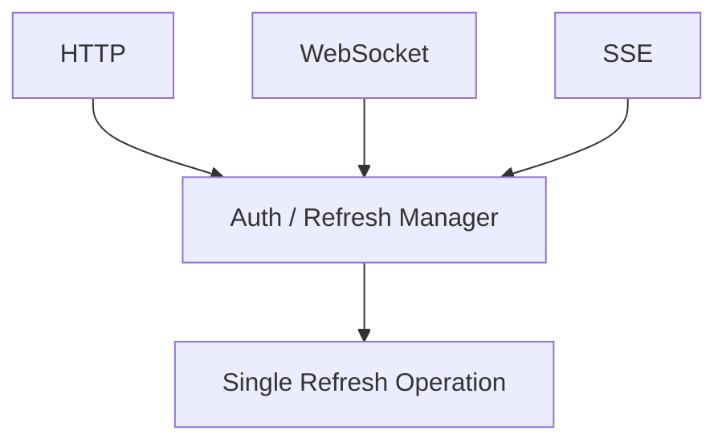

HTTP、WS、SSE 都只能要求 `ensureFreshSession()`，不能各自 `doRefresh()`。

Refresh Token 也不應當作 WebSocket / SSE credential。Refresh Token 只負責延續 Session；Access Token 或 Session 才負責 HTTP / WS / SSE 的實際授權。

### Refresh 後如何處理長連線

最容易推理的方式：

```text
Refresh 成功
↓
Authentication Generation 改變
↓
舊 Connection stale
↓
Close
↓
Reconnect / Re-auth
```

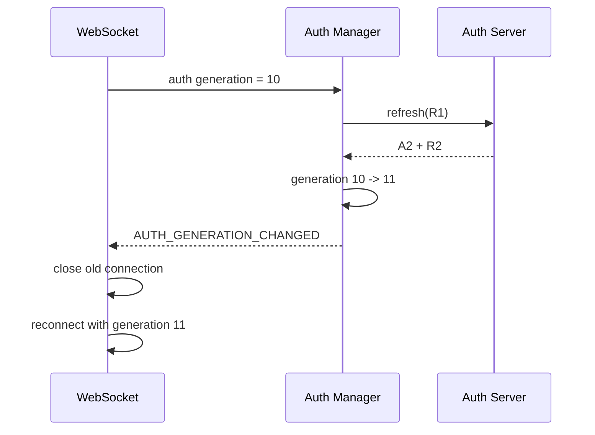

Server 也要明確決定長連線如何遵守 Access Token / Session expiry；如果只在 handshake 驗證一次，舊連線可能長期繞過 Token 到期時間。

Refresh 失敗時不得無限重連，否則會形成 refresh loop + reconnect storm。

### 核心 invariant

```text
Refresh ownership
= Auth Manager only
```

```text
Refresh Token
≠ Transport Credential
```

```text
Connection generation
< Current Auth Generation

→ 舊 Connection 不可持續以舊認證運作
```

---

## 6. SSR / Server-side Refresh 協調

### 問題

當系統同時有 Browser、middleware、SSR、route handler、BFF、多個 Server Instance 時，同一 Session 可能出現多個 Refresh writer：

```text
Browser → refresh(R1)
SSR     → refresh(R1)
```

或：

```text
Instance A → refresh(R1)
Instance B → refresh(R1)
```

這裡真正的問題不是 SSR API，而是：**誰有權修改同一個 Session？**

### 唯一 Refresh Authority

同一 Session 最好只有一個邏輯元件有權決定：

```text
R1 → R2
```

其他層只能要求：

```text
ensureAuthenticatedSession()
```

而不是各自執行 `refresh()`。

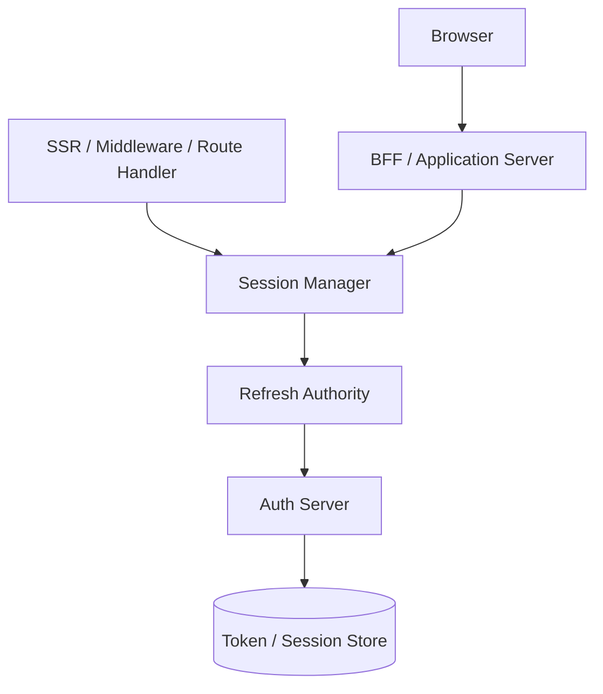

### Server-side Single-flight 的 scope

記憶體中的 `refreshPromise` 只能管同一 process。多個 PHP worker、Node instance 或容器不共享這份狀態。

Server-side 協調應以 Session 為單位，例如：

```text
refresh-lock:S123
```

而不是 global lock，避免不同使用者彼此阻塞。

但 Redis lock、DB advisory lock 等只是在降低正常競爭，不能當成最後正確性防線。最後仍要回到第 3 點：

```text
R1 consume <= 1
R1 successor <= 1
```

### 最棘手問題：Server 成功，Browser 沒拿到新 Cookie

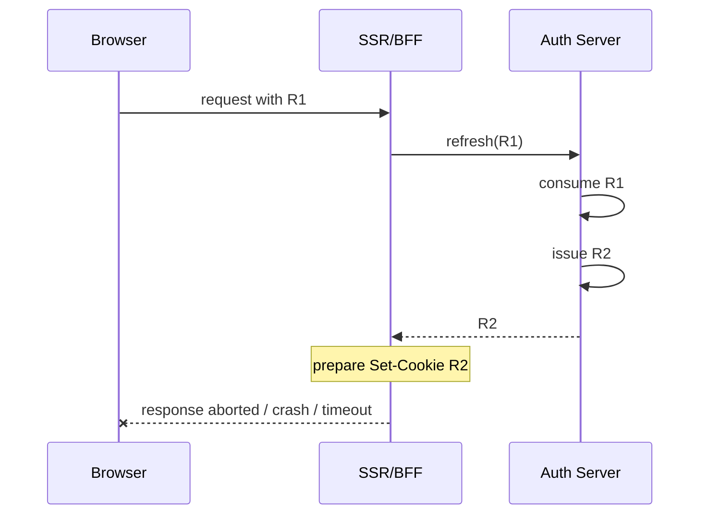

Auth Server：

```text
R1 = USED
R2 = VALID
```

Browser：

```text
Cookie 仍是 R1
```

Server state commit 與 Browser Cookie 更新無法放進同一個真正 transaction，因此系統必須允許：

```text
Server 已成功
Client 卻不知道成功
```

並透過第 3 點的 Token Family / Retry-safe Rotation 恢復。

### 更乾淨的純 Web 架構

若 Browser 只持有 opaque session cookie：

```text
Browser
↓
session_id = S123
↓
BFF

Server-side Session Store
S123
├─ Access Token A1
├─ Refresh Token R1
└─ Generation 10
```

那麼：

```text
R1 → R2 → R3
```

全部留在 Server-side，Browser 的 Cookie 不需要跟著每次 Rotation 改變，可以直接消除「Rotation 成功但新的 Refresh Cookie 沒送到 Browser」這類 Token delivery 問題。

### 核心 invariant

```text
同一 Session
Refresh Authority 數量 = 1
```

```text
Application Lock
= Coordination

Atomic Rotation
= Correctness
```

```text
Server Refresh 成功
Client 不知道成功

必須是可恢復狀態
```

---

## 7. Refresh Cookie 的傳送邊界：SameSite、CORS、Domain、CSRF

第一點回答「Refresh Token 放哪裡？」；第七點回答「既然放 Cookie，什麼 request 有資格帶它？」

### HttpOnly 防偷，不代表防冒用

Cookie 由 Browser 自動攜帶。攻擊者不一定需要知道 R1，只要能讓 Browser 發出 request，且 Cookie 規則允許攜帶 R1，就可能影響 Session。

所以：

```text
HttpOnly
≠
CSRF protection
```

### SameSite 與 CORS 是兩個不同邊界

例如：

```text
https://app.example.com
https://api.example.com
```

兩者通常是：

```text
Cross-Origin = 是
Same-Site    = 是
```

因此不能因為 hostname 不同就直接設定 `SameSite=None`。

- SameSite：控制 Cookie 在 cross-site 情境是否攜帶。
- CORS：控制跨 origin JavaScript 是否能取得 response，以及 credentialed cross-origin request 是否允許。

### Cookie Scope 應最小化

若 Refresh Token 只需要送到 `api.example.com/auth/refresh`，優先考慮 Host-only Cookie 與最小 Path，避免用 `Domain=example.com` 把更多子網域納入 credential scope。

### 跨 Origin Credential

Fetch：

```js
fetch('https://api.example.com/auth/refresh', {
    method: 'POST',
    credentials: 'include',
})
```

Axios：

```js
axios.post('/auth/refresh', {}, {
    withCredentials: true,
})
```

Server：

```http
Access-Control-Allow-Origin: https://app.example.com
Access-Control-Allow-Credentials: true
```

Credentialed CORS 不應搭配：

```http
Access-Control-Allow-Origin: *
```

### CORS 不是 CSRF 防線

CORS 主要限制跨來源 JavaScript 是否能讀 response，不代表所有 cross-origin request 都無法送到 Server。

Refresh endpoint 本身會：

```text
R1
↓ consume
R2
```

因此它是 Session Mutation，應搭配：

```text
SameSite
+
Origin validation
+
必要時 CSRF Token / request binding
```

### 核心 invariant

```text
JavaScript 不需要知道 Refresh Token
```

但：

```text
不是任何能讓 Browser 帶上 Refresh Cookie 的 request
都有資格執行 Refresh
```

---

## 8. Logout / Refresh Race

### 問題

Refresh 與 Logout 是方向相反的 Session transition：

```text
Refresh
AUTHENTICATED
↓
REFRESHING
↓
AUTHENTICATED
```

```text
Logout
AUTHENTICATED
↓
LOGGING_OUT
↓
LOGGED_OUT
```

可能發生：

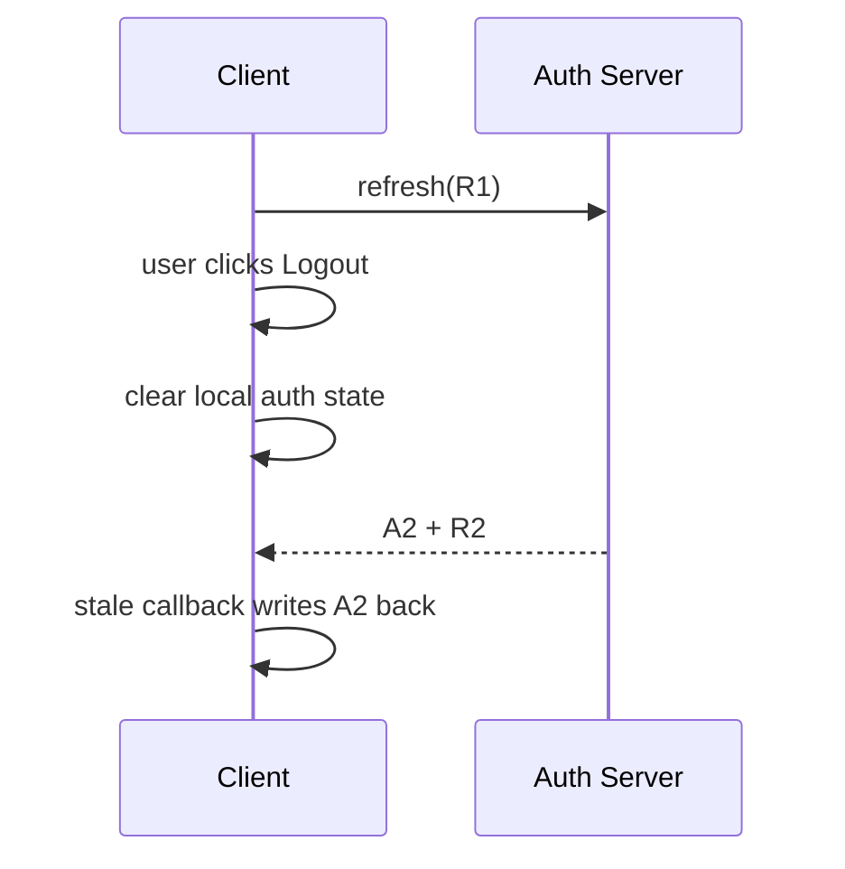

結果是 UI 已經在登入頁，但舊 Refresh response 又把 Authentication State 復活。

### 規則：Logout 優先級高於舊 Refresh

一旦 Logout 開始，必須：

1. 阻止新的 Refresh。
2. 取消進行中的 Refresh。
3. 舊 Refresh 即使回來，也不得寫回 Authentication State。
4. Server 撤銷整個 Session / Token Family。
5. 通知其他 Tab。
6. 關閉 WS / SSE。

### AbortController 不夠

Abort 只能做到：

```text
Stop if possible
```

不能保證 Server 尚未完成：

```text
R1 → R2
```

所以還需要 Authentication Generation / Session Version：

```text
Refresh started at generation 10

Logout
10 → 11

Refresh response returns
response generation = 10
current generation  = 11

→ ignore stale result
```

### Client 流程

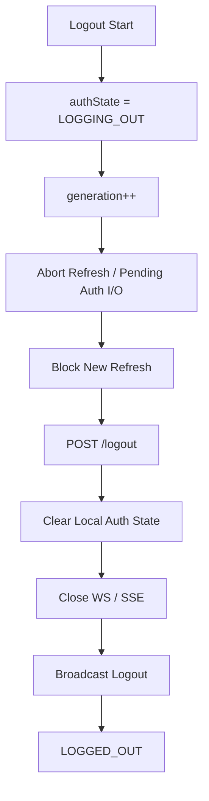

### Server 應 revoke Session / Token Family

假設：

```text
Session S1
R1 → R2 → R3
```

Logout 應撤銷整個 Session / Token Family，而不是只刪目前 R3。

不論順序：

```text
Refresh 先完成 → Logout revoke S1
```

或：

```text
Logout 先完成 → 後續 Refresh 檢查 S1 revoked 並拒絕
```

最後都必須：

```text
FINAL STATE = LOGGED_OUT
```

### 核心 invariant

```text
Logout committed
↓
任何舊 Refresh
都不得把 Session 復活
```

---

## 9. 是否真的需要 Refresh Token

這一點真正要問的是：

> **系統哪個具體需求是 Server-side Session 無法完成，而必須使用 Access Token + Refresh Token？**

### Server-side Session 模型

```text
Browser
↓
session_id = S123
↓
Server

Redis / DB
S123
├─ user_id
├─ expires_at
├─ permissions
└─ session metadata
```

Browser 只持有 opaque session cookie，不需要：

```text
R1 → R2 → R3
```

這整套 Rotation。

### Access Token + Refresh Token 適合的情境

需要有具體需求，例如：

- Mobile App。
- Desktop App。
- 第三方 API Client。
- OAuth / OIDC。
- 多個獨立 Resource Server。
- Client 需要攜帶可獨立驗證的 API credential。
- 不適合讓所有 Resource Server 都依賴同一個 Web Session Store。

以下都不是足夠理由：

```text
前後端分離
微服務
JWT 比較現代
JWT 是 stateless
```

因為完整實作 Refresh Token Rotation 後，通常已經需要：

```text
family_id
consumed_at
replaced_by
revoked_at
generation
reuse detection
session status
```

實際上早已有大量 Server-side state。

### 架構判斷流程

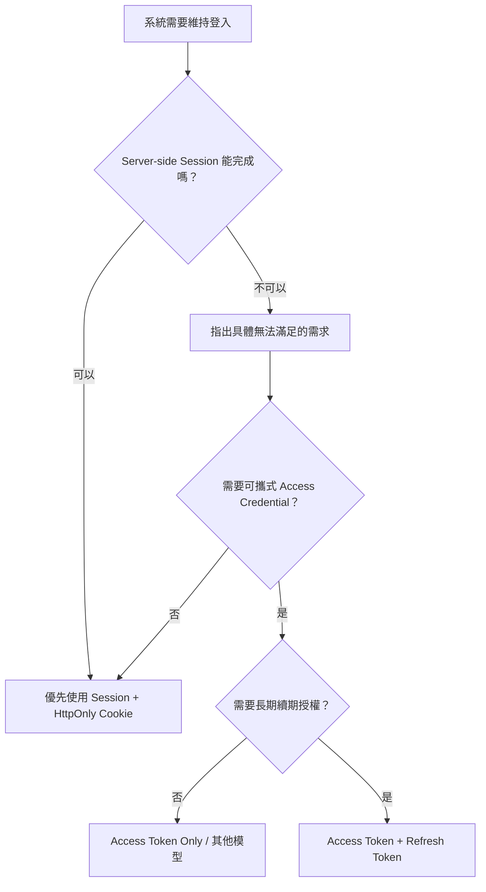

### 核心考題

```text
系統哪個具體需求
是 Server-side Session 無法完成，
而必須使用 Access Token + Refresh Token？
```

如果沒有具體答案，就不應先承擔前八點的複雜度。

---

## 10. Refresh Token Session 生命週期

Rotation 可以延續 Session，但不能讓 Session 永生。

### 問題

如果每次 Refresh 都重新延長 Refresh Token 30 天：

```text
8/1  R1 expires 8/31

8/20 Refresh
↓
R2 expires 9/19

9/10 Refresh
↓
R3 expires 10/10
```

只要使用者持續使用，Session 可能永不結束。

### 必須分開定義

#### Access Token TTL

控制短效 API credential 多快需要更新，例如 15 分鐘。

#### Refresh Token TTL / Idle Timeout

控制多久沒使用後不能再 Refresh，例如 7 天無活動。

#### Absolute Session Expiration

Login 時就決定最晚 Session 結束時間，不因 Rotation 延後，例如 30 天。

建議模型：

```text
Access Token TTL      = 15 分鐘
Refresh Idle Timeout  = 7 天
Session Absolute TTL  = 30 天
```

意思：

```text
15 分鐘
→ Access Token 更新
```

```text
連續 7 天無活動
→ Refresh Session 失效
```

```text
即使每天持續使用
30 天後
→ 強制重新登入
```

### Sliding vs Absolute

```text
Sliding Expiration
→ 每次使用可延後 idle expiry
```

```text
Absolute Expiration
→ Login 時決定最晚到期時間，不因 Rotation 延後
```

兩者應同時存在。

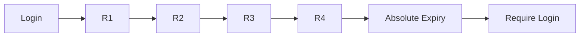

### 核心 invariant

```text
Rotation 可以延續 Session
≠
Rotation 可以讓 Session 永生
```

---

## 十點之間的依賴關係

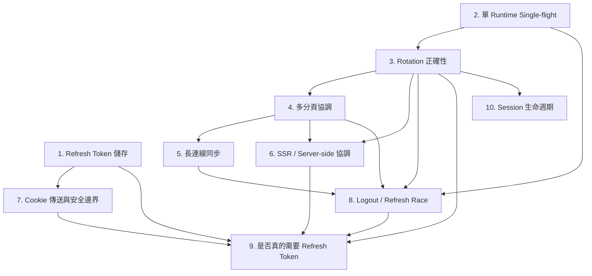

可濃縮成四大類：

```text
Credential Security
├─ 1 儲存
└─ 7 Cookie / Cross-Origin / CSRF

Concurrency & Consistency
├─ 2 Single-runtime
├─ 3 Rotation
├─ 4 Cross-tab
├─ 6 SSR / Server-side
└─ 8 Logout race

Session Propagation
└─ 5 WebSocket / SSE

Architecture & Policy
├─ 9 是否真的需要 Refresh Token
└─ 10 Session 生命週期
```

---

## 建議的整體架構

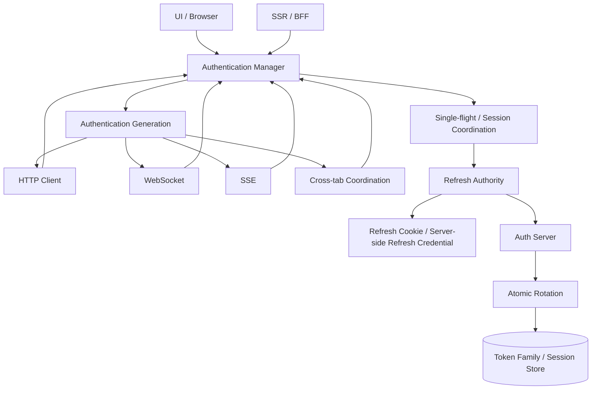

責任分界：

```text
UI
→ 不碰 Refresh Token

HTTP / WS / SSE
→ 不直接 Refresh

Authentication Manager
→ 決定 Session 是否需要 Refresh

Refresh Authority
→ 唯一執行 Refresh

Auth Server
→ Atomic Rotation / Reuse / Revocation

Session / Token Store
→ Token Family / Generation / Lifetime
```

---

## 最低限度測試矩陣

| 類型 | 測試情境 | 應有結果 |
|---|---|---|
| 儲存 | XSS 嘗試讀 Refresh Token | JS 無法直接取得 Refresh Token |
| 單 Runtime | 10 個工作同時要求 Refresh | 實際只有 1 個 Refresh |
| Rotation | 同一 R1 同時送兩次 | 只能產生 1 個 successor |
| Retry | Server 成功但 Client timeout，再送 R1 | 不應直接造成正常 Session 被誤判為攻擊 |
| 多 Tab | Tab A / B 同時需要 Refresh | Browser Session 合計只執行 1 次正常 Refresh |
| 多 Tab | Tab A Refresh 後 Tab B 恢復 | Tab B 最終收斂到新 Auth Generation |
| WebSocket | Refresh 後舊 WS 仍存在 | 必須 reconnect / re-auth / 被 Server 關閉 |
| SSE | Refresh 後重連 | 不應重複或漏失事件狀態 |
| SSR | 兩個 Server Instance 同時使用 R1 | Auth Server 仍保證 unique successor |
| SSR | Rotation 成功但 Set-Cookie response 遺失 | Session 必須有恢復策略 |
| Cookie | Cross-origin credentialed request | CORS / credentials 設定正確 |
| CSRF | 非允許 Origin 觸發 Refresh | Server 拒絕 |
| Logout | Refresh 執行中按 Logout | 舊 Refresh 不得復活 Session |
| Logout | 多 Tab，其中一個 Logout | 所有 Tab 最終 Logged Out |
| Lifetime | 持續 Refresh 超過 Absolute TTL | 強制重新登入 |
| Idle | 超過 Idle Timeout 再 Refresh | Refresh 失敗並要求重新登入 |

---

## 最終設計檢查

在開始寫 Refresh Token 前，先回答：

```text
1. 系統哪個具體需求是 Server-side Session 無法完成的？
2. Refresh Token 存在哪裡？
3. 誰有權 Refresh？
4. 同一 Session 同時間可以有幾個 Refresh？
5. Server 如何保證 Rn 只產生一個 R(n+1)？
6. Refresh response 遺失怎麼恢復？
7. 多 Tab 如何協調？
8. WebSocket / SSE 如何跟上新 Authentication State？
9. SSR / 多 Server instance 誰是 Refresh Authority？
10. Cookie 的 Domain / SameSite / CORS / CSRF 怎麼限制？
11. Logout 與 Refresh 同時發生時誰優先？
12. Session 最長可以活多久？
```

如果以上任何一題沒有明確答案，Refresh Token 還不算完成設計。

---

## 最核心的五條 invariant

```text
Invariant 1
Refresh Token 不應是 JavaScript 可直接讀取的長期 credential。
```

```text
Invariant 2
同一 Session 在合理協調範圍內，
正常情況同時間最多只有一個 Refresh operation。
```

```text
Invariant 3
每一顆 Refresh Token：
consume <= 1
successor <= 1
```

```text
Invariant 4
Logout committed 後，
任何舊 Refresh 都不得重新建立 authenticated Session。
```

```text
Invariant 5
Rotation 可以延續 Session，
但不能讓 Session 無限延續。
```

真正可靠的 Refresh Token 設計，核心不是「Refresh API 能不能成功」，而是：

> **在併發、重試、跨分頁、SSR、長連線、Logout、網路失敗與生命週期交錯時，整個 Session 是否仍能維持單一、可恢復、可撤銷、可推理的狀態。**
