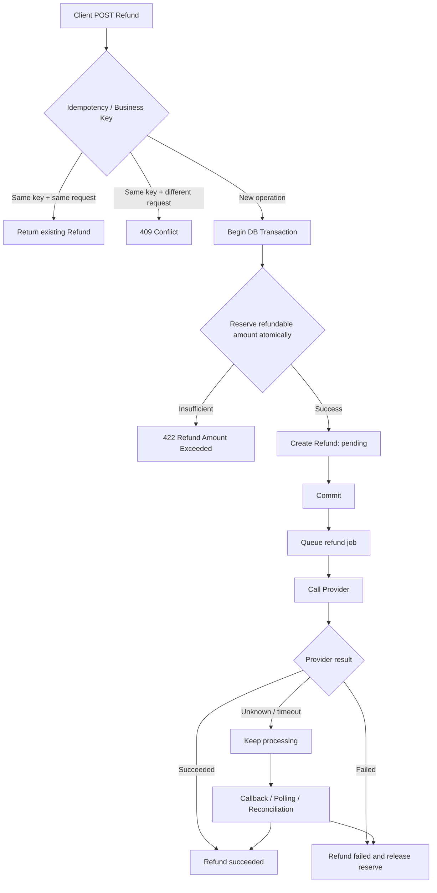

# RESTful 退款 API 設計：從 Resource Modeling 到 Idempotency、Concurrency 與 Reconciliation

#restful-api #http #payment #refund #idempotency #concurrency #transaction #backend #knowledge

## 這是什麼

這份文件以「設計一個退款 API」作為後端工程師面試題，整理從基礎 RESTful API 到正式金流系統會遇到的設計問題。

重點不是背 `GET / POST / PUT / DELETE` 或 HTTP Status Code，而是看面對部分退款、多次退款、timeout retry、併發退款、第三方非同步退款、callback 遺失與 API 重送時，能否維持清楚的 Resource、State Machine、Invariant 與 API Contract。

## 核心結論

- `Refund` 應視為獨立 resource，而不只是 Payment 上的一個動作。
- 部分退款與多次退款不是完全相同的問題；前者在問單筆 Refund 金額，後者在問 Payment 與 Refund 的 1:N 關係。
- Idempotency 要同時處理「同 key 同內容」與「同 key 不同內容」；後者應拒絕，而不是默默回舊結果。
- 商戶退款單號是 business operation identity；`Idempotency-Key` 是 HTTP operation identity，兩者可以同時存在。
- Redis Lock 可以降低 contention，但不能成為金流 correctness 的唯一保證；退款不超額這類 invariant 最後仍要由 DB transaction、constraint 或 atomic conditional update 保證。
- 非同步退款不能只計算已成功退款金額，`pending / processing` 中已保留的退款額度也必須納入。
- 第三方退款不能只依賴 callback；正式系統需要 callback、主動查詢、排程 reconciliation 與人工查詢共同收斂狀態。
- 設計這類 API 時，先定義「什麼條件永遠不能被破壞」，再決定 Redis Lock、DB Lock 或其他實作手段。

---

## 0. 基礎題目

> 設計一個退款 API。
>
> 一筆付款需要支援退款，並逐步追加：
>
> - 可以部分退款嗎？
> - 可以退款很多次嗎？
> - timeout 後 retry 怎麼辦？
> - 同一個 Idempotency-Key，但重送內容不同呢？
> - 兩筆退款同時進來呢？
> - 退款是非同步呢？
> - 第三方退款成功但 callback 丟失呢？
> - API 重送呢？
> - 商戶如何查狀態？
> - 同一筆 Payment 不准超額退款呢？

這些追加題不是彼此獨立的小技巧，而是在測同一個退款模型遇到不同 failure mode 時是否仍然成立。

---

## 1. 先把 Refund 當成 Resource

基礎 API 建議：

```http
POST /payments/{payment_id}/refunds
```

Request：

```json
{
  "amount": 200
}
```

成功建立 Refund：

```http
201 Created
```

```json
{
  "id": "refund_123",
  "payment_id": "payment_123",
  "amount": 200,
  "status": "pending"
}
```

比起：

```http
POST /payment/payment_123/refund
```

前者比較清楚地表達：

> 在 `payment_123` 底下建立一筆 Refund resource。

之後查詢狀態、保存第三方交易編號、錯誤原因與歷程都會自然很多。

如果 `refund_id` 在整個系統中唯一，查詢也可以簡化為：

```http
GET /refunds/refund_123
```

---

## 2. 可以部分退款嗎？

假設原付款：

```text
payment.amount = 1000
```

建立：

```text
Refund #1 = 200
```

這是 partial refund。

這題真正要確認的是：

```text
refund.amount <= refundable_amount
```

Response 不建議使用：

```json
{
  "from": 1000,
  "to": 800
}
```

因為 `from`、`to` 不知道是在表示 Payment balance、商戶錢包、已退款金額，還是剩餘可退款額度。

如果 API 需要回可退款資訊，應使用明確名稱：

```json
{
  "amount": 200,
  "refunded_amount": 200,
  "refundable_amount": 800
}
```

API contract 最重要的不是「人看得懂」，而是每一個欄位的業務定義沒有歧義。

---

## 3. 可以退款很多次嗎？

這和「部分退款」相關，但不是同一題。

部分退款在問：

> 單筆 Refund 是否可以小於 Payment amount？

多次退款在問：

> Payment 與 Refund 是否是 1:N？

例如：

```text
Payment = 1000

Refund #1 = 200 succeeded
Refund #2 = 300 succeeded
Refund #3 = 100 failed
```

資料模型應該是：

```text
payments
    1
    │
    └──── N refunds
```

例如：

```text
payments
--------
id
amount
status

refunds
-------
id
payment_id
amount
status
```

不能只把退款理解成：

```text
payment.balance -= refund_amount
```

因為正式系統還要保存每一筆 Refund 的狀態與歷程。

---

## 4. Timeout 後 Client Retry 怎麼辦？

典型問題：

```text
Client
  │
  │ POST refund
  ▼
Server
  │
  ├── Refund 已建立
  │
  └── Response 在網路上 timeout
```

Client 不知道退款是否成功建立，因此 retry。

解法使用：

```http
Idempotency-Key: abc123
```

例如：

```http
POST /payments/payment_123/refunds
Idempotency-Key: abc123
```

第一次 request：

```json
{
  "amount": 200
}
```

Server 至少保存：

```text
idempotency_key
request_fingerprint
refund_id
response/status
```

Client timeout 後再次傳相同 request：

```text
same key
same payload
```

Server 應回原本的：

```text
refund_123
```

而不是再建立：

```text
refund_124
```

---

## 5. 同 Idempotency-Key，但重送內容不同呢？

這是 timeout retry 很重要但很容易漏掉的情況。

第一次：

```json
{
  "amount": 200
}
```

第二次：

```json
{
  "amount": 500
}
```

兩次都使用：

```text
Idempotency-Key = abc123
```

這不能視為正常 retry。

應拒絕，例如：

```http
409 Conflict
```

```json
{
  "code": "IDEMPOTENCY_KEY_REUSED",
  "message": "Idempotency key was already used with different request data."
}
```

實作上可以保存 canonicalized request 後的雜湊值，而不是直接比較未處理的 JSON 字串：

```text
idempotency_key
request_hash
refund_id
status
```

核心規則：

```text
same key + same semantic request
→ retry
→ return original operation

same key + different semantic request
→ conflict
```

---

## 6. 客服後台退款與商戶 API 要分開思考

設計退款 API 時，要先確認 caller 是誰。

### 6.1 客服後台操作

客服在後台按退款，通常沒有天然的 `merchant_refund_no`。

前端或 Server 可以建立：

```text
operation_id / idempotency_key
```

例如：

```http
POST /payments/P001/refunds
Idempotency-Key: 550e8400-e29b-41d4-a716-446655440000
```

它主要防止：

```text
按鈕連點
瀏覽器 timeout
前端 retry
網路 retry
```

### 6.2 商戶系統呼叫

商戶通常可以提供自己的退款單號：

```json
{
  "merchant_refund_no": "R202608140001",
  "amount": 200
}
```

DB 應至少對：

```text
merchant_id + merchant_refund_no
```

建立 unique constraint。

這個單號本身就是 business idempotency 的一部分。

---

## 7. `Idempotency-Key` 與商戶退款單號不是完全相同的東西

可以這樣區分：

```text
Idempotency-Key
= HTTP operation identity

merchant_refund_no
= Business operation identity
```

兩者可以同時存在。

例如：

```http
POST /payments/P001/refunds
Idempotency-Key: http-op-123
```

```json
{
  "merchant_refund_no": "R001",
  "amount": 200
}
```

HTTP retry 可以靠 `Idempotency-Key` 判斷；跨 request、跨時間的商戶業務身份仍由 `merchant_refund_no` 保證。

---

## 8. 同 merchant_refund_no，但內容不同怎麼辦？

第一次：

```json
{
  "merchant_refund_no": "R001",
  "amount": 200
}
```

第二次：

```json
{
  "merchant_refund_no": "R001",
  "amount": 900
}
```

不能只回「單號重複」後結束。

應區分：

```text
同 refund_no + 同 immutable request fields
→ 視為 retry
→ 回原 Refund

同 refund_no + 不同 immutable request fields
→ conflict
```

例如：

```http
409 Conflict
```

```json
{
  "code": "REFUND_NO_CONFLICT",
  "message": "Refund number already exists with different request data."
}
```

這個檢查除了保護 server，也能及早抓到商戶端重複使用單號但金額不同的 bug。

---

## 9. Idempotency 資料可以只放 Redis 嗎？

Redis 很適合快速 lookup，但不能讓 Redis TTL 單獨決定：

> 這是不是同一筆退款。

例如：

```text
13:00
客服退款 500
Provider 已成功
我方 Response timeout

Redis TTL = 30 min

13:40
客服再次執行退款
```

如果規則是：

```text
Redis miss
→ 當成新退款
```

就可能退款兩次。

比較合理的定位：

```text
Redis
→ 快速 lookup
→ 暫時處理狀態
→ 降低 DB 查詢量

DB
→ Refund 最終紀錄
→ business idempotency
→ correctness source of truth
```

Redis 可以有 TTL，但 correctness 不應因 cache 過期而消失。

如果需要另外保存 HTTP idempotency record，可以設計：

```text
idempotency_requests
--------------------
scope
key
request_hash
refund_id
status
created_at
expires_at
```

這裡的 `expires_at` 是產品與風險政策，不應單純等同 Redis key TTL。

---

## 10. 兩個退款同時進來怎麼辦？

假設：

```text
Payment = 1000

Request A = refund 700
Request B = refund 700
```

兩個 request 同時讀到：

```text
refundable = 1000
```

如果各自判斷：

```text
700 <= 1000
```

最後可能建立：

```text
700 + 700 = 1400
```

真正需要保護的不是「request 不要同時進來」，而是 invariant：

```text
succeeded_refund
+ reserved_refund
<= payment.amount
```

這是整個 concurrency 題目的核心。

---

## 11. Redis Lock 為什麼不應是第一層 correctness guarantee？

Redis Lock 確實可以降低同一 Payment 同時進 DB 的請求數量，也能減少 DB lock contention。

但如果把它當唯一保證，會出現新的 failure mode。

### 11.1 Process crash

```text
取得 Redis lock
↓
開始執行退款
↓
process crash
```

所以 Redis Lock 必須有 TTL。

### 11.2 Lock TTL 提前到期

假設：

```text
Lock TTL = 5 sec
```

但 A 執行 6 秒：

```text
A 仍在執行
↓
Redis lock expired
↓
B 取得同一把 lock
↓
A、B 同時執行
```

原本用來避免 concurrency 的 lock，又重新產生 concurrency。

### 11.3 Distributed Lock 本身也有一致性問題

還需要考慮：

```text
Redis failover
network partition
replication delay
lock ownership
lease renewal
fencing token
```

所以 Redis Lock 並不是錯，而是它比較適合定位成：

```text
performance / contention optimization
```

而不是：

```text
final correctness guarantee
```

---

## 12. DB Lock 為什麼適合保護退款 invariant？

例如：

```sql
BEGIN;

SELECT *
FROM payments
WHERE id = :payment_id
FOR UPDATE;
```

A 先取得 row lock：

```text
Payment = 1000
Refund A = 700
```

A 建立 Refund、更新保留額度並 commit。

B 接著才讀到：

```text
refundable = 300
requested = 700
```

因此拒絕。

它的優勢不是 DB 比 Redis 快，而是：

> Lock、資料讀取與 mutation 都在同一個 transaction system 裡。

DB 才是退款資料的 source of truth，因此更容易把「判斷 + 寫入」放在同一個 atomic boundary。

---

## 13. DB Lock 不會提高 DB 負載嗎？

會。

大量 `SELECT ... FOR UPDATE` 可能造成：

```text
lock contention
transaction wait
connection accumulation
deadlock
DB CPU / IO 壓力
```

所以答案不是：

```text
DB Lock 永遠比 Redis Lock 好
```

而是要分清責任：

```text
Redis Lock
= traffic / contention control

DB Transaction
= atomicity

DB constraint / conditional update
= invariant guarantee
```

一個常見架構是：

```text
Request
  │
  ▼
Redis Lock（可選）
  │
  │ 降低同一 Payment 的併發
  ▼
DB Transaction
  │
  ▼
Invariant Check
  │
  ▼
Create Refund
  │
  ▼
Commit
```

即使 Redis 發生問題，DB 最後仍不得允許超額退款。

---

## 14. 不一定要 `SELECT ... FOR UPDATE`：Conditional Atomic Update

如果要保護的 invariant 很單純，可以不用先查再鎖。

假設：

```text
amount          = 1000
refunded_amount = 200
reserved_amount = 300
```

現在要退款 400。

可以直接：

```sql
UPDATE payments
SET reserved_amount = reserved_amount + :refund_amount
WHERE id = :payment_id
  AND amount - refunded_amount - reserved_amount >= :refund_amount;
```

檢查：

```text
affected_rows = 1
→ reserve 成功

affected_rows = 0
→ 可退款額度不足
```

這比：

```text
SELECT
↓
應用程式判斷
↓
UPDATE
```

更能直接避免 read-modify-write race condition。

如果 Refund 建立與 reserve 需要一起成功，仍應包在同一個 transaction 中。

因此三種策略可以這樣看：

| 作法 | 主要用途 | Correctness | DB contention |
|---|---|---:|---:|
| Redis Lock | 擋大量同資源 request | 單獨使用不夠 | 低 |
| `SELECT ... FOR UPDATE` | 複雜 transactional invariant | 強 | 較高 |
| Conditional UPDATE | 單純數值 invariant | 強 | 通常較低 |

---

## 15. 非同步退款怎麼設計？

如果退款需要呼叫第三方 Provider，通常不是同步完成。

流程可以是：

```text
POST Refund
↓
建立 Refund
status = pending
↓
送 Queue
↓
Worker 呼叫 Provider
↓
status = processing
↓
succeeded / failed
```

建立 Refund 時可以回：

```http
201 Created
```

如果 API contract 強調「工作已接受但尚未完成」，也可以使用：

```http
202 Accepted
```

Response 不應在 `pending` 時假裝資金已經真的從 800 變 600：

```json
{
  "id": "refund_123",
  "payment_id": "payment_123",
  "amount": 200,
  "status": "pending"
}
```

State Machine 可以定義為：

```text
pending
   │
   ▼
processing
   │
   ├────► succeeded
   │
   └────► failed
```

---

## 16. Async Refund 為什麼需要 reserved amount？

假設：

```text
Payment = 1000
```

第一筆：

```text
Refund A = 800
status = processing
```

第二筆同時來：

```text
Refund B = 500
```

如果系統只計算 `succeeded` refund，這時可能看到：

```text
refunded = 0
```

因而接受 B。

最後就可能變成：

```text
800 + 500 = 1300
```

因此非同步流程至少要區分：

```text
succeeded_refund
reserved_refund
refundable_amount
```

例如：

```text
Payment amount    = 1000
Succeeded refund  = 200
Reserved refund   = 500
Failed refund     = 100

Refundable amount = 300
```

核心公式：

```text
refundable_amount
=
payment.amount
- succeeded_refund
- reserved_refund
```

哪些 state 會占 reserved amount，必須由 state machine 明確定義，例如：

```text
pending     → reserve
processing  → reserve
succeeded   → transferred to refunded
failed      → release reserve
```

---

## 17. 第三方退款成功，但 Callback 丟失怎麼辦？

不能只依賴 callback。

典型情況：

```text
Our System
Refund = processing

Provider
Refund = succeeded

Callback lost
```

如果沒有其他收斂機制，我方 Refund 會永遠停在 `processing`。

正式系統通常需要：

```text
callback
+
scheduled polling
+
reconciliation
+
manual query
```

例如排程定期查詢長時間停在 `processing` 的 Refund：

```text
Our System: processing
Provider:   succeeded

↓ reconciliation

Our System: succeeded
```

這是第三方金流整合的基本 production 能力。

---

## 18. Callback 晚到或重送怎麼辦？

假設 reconciliation 已經先更新：

```text
processing → succeeded
```

三小時後 Provider callback 又來一次：

```text
succeeded
```

Callback handler 必須 idempotent。

不能因為 callback 又來一次，就再次執行：

```text
balance adjustment
ledger entry
refund completion event
```

狀態機至少要保證：

```text
succeeded → succeeded
```

是 no-op，而不是重新執行退款完成副作用。

---

## 19. 「API 重送」要先問是哪一段

「API 重送怎麼辦？」本身資訊不足，至少要拆成三種。

### 19.1 Merchant → 我方

```text
Merchant
→ Refund API
→ timeout
→ retry
```

使用：

```text
Idempotency-Key
merchant_refund_no
```

### 19.2 我方 → Provider

```text
Our System
→ Provider Refund API
→ timeout
```

這個最危險。

Provider 有可能其實已成功，只是 response 沒回來，所以不能看到 timeout 就直接再退款一次。

必須依 Provider 能力使用：

```text
provider idempotency key
provider request id
query-before-retry
```

### 19.3 Provider → 我方 Callback

```text
Provider
→ Callback
→ 我方 timeout
→ Provider callback retry
```

我方 callback endpoint 必須 idempotent。

因此真正成熟的回答不是直接說「重送就查資料」，而是先切清楚 retry 發生在哪一個 boundary。

---

## 20. 商戶怎麼查退款狀態？

如果 `refund_id` 全系統唯一：

```http
GET /refunds/refund_123
```

Response：

```json
{
  "id": "refund_123",
  "payment_id": "payment_123",
  "amount": 200,
  "status": "processing",
  "failure_code": null,
  "failure_message": null
}
```

失敗時：

```json
{
  "id": "refund_123",
  "payment_id": "payment_123",
  "amount": 200,
  "status": "failed",
  "failure_code": "PROVIDER_REJECTED",
  "failure_message": "Refund rejected by provider"
}
```

也可以使用巢狀 URI：

```http
GET /payments/P001/refunds/R001
```

但如果 Refund 本身已有全域唯一 identity，頂層 `/refunds/{id}` 通常更直接。

---

## 21. 超額退款該回什麼？

例如：

```text
Payment amount     = 1000
Refunded amount    = 800
Reserved amount    = 0
Refundable amount  = 200
Requested amount   = 300
```

`422 Unprocessable Content` 是合理的 API policy：

```http
422 Unprocessable Content
```

```json
{
  "code": "REFUND_AMOUNT_EXCEEDED",
  "message": "Refund amount exceeds refundable amount",
  "details": {
    "payment_amount": 1000,
    "refunded_amount": 800,
    "reserved_amount": 0,
    "refundable_amount": 200,
    "requested_amount": 300
  }
}
```

不要只寫：

```text
餘額不足
```

因為這裡不是 Wallet balance，而是 Payment 的 refundable amount 不足。

也不要回：

```json
{
  "status": "pending"
}
```

因為 Refund 根本沒有成功建立。

---

## 22. 完整退款流程



這張圖裡真正不能被破壞的是：

```text
succeeded_refund
+ reserved_refund
<= payment.amount
```

所有 Lock、Transaction、Retry、Queue、Callback 都只是維護這個條件與 Refund State Machine 的手段。

---

## 23. 面試回答應該怎麼分層

如果面試官問：

> 兩筆退款同時進來怎麼辦？

只回答：

> 用 Redis Lock。

代表知道工具，但還沒講清楚問題。

更完整的回答：

> 我會先定義要保護的 invariant：已成功退款加上處理中保留退款額度不能超過原 Payment amount。Redis Lock 可以降低同一 Payment 的併發請求，但不會把它當唯一一致性保證，因為 Refund 最終資料存在 DB，而且 Redis Lock 還有 TTL、process crash、failover 等問題。若只是退款額度 reserve，我會優先考慮 DB conditional atomic update；如果牽涉複雜多筆資料，再用 transaction 加 `SELECT ... FOR UPDATE`。Redis Lock 視流量情況作為前置 contention reduction。

這類回答的差異在於：

```text
工具導向：
「我要用哪一種 Lock？」

設計導向：
「哪一個 invariant 不能被破壞？」
```

後者才是系統設計的核心。

---

## 24. 這題真正測什麼

表面上是在測 RESTful API，實際上至少有四層：

| 層級 | 核心問題 |
|---|---|
| Resource | Refund 是不是獨立 resource？ |
| State Machine | `pending / processing / succeeded / failed` 如何轉換？ |
| Invariant | 如何永遠保證不超額退款？ |
| API Contract | Retry、HTTP status、error response、query 如何定義？ |

進入 production 後還會延伸：

```text
Idempotency
Concurrency
Atomicity
Async processing
Provider retry
Callback idempotency
Reconciliation
Audit trail
```

因此「熟悉 RESTful API 設計與開發」不應只代表會做 CRUD。

至少要能在這類題目持續追加限制後，仍維持一致的 Resource Modeling、HTTP Contract 與資料一致性。

---

## 25. 最後判斷原則

遇到退款、轉帳、提款、付款、取消訂單這類 API，都先依序問：

1. **Resource 是什麼？**
2. **State Machine 是什麼？**
3. **哪個 Invariant 永遠不能被破壞？**
4. **誰會 Retry？在哪一個 boundary？**
5. **Idempotency identity 是 HTTP 層還是 Business 層？**
6. **Correctness 最後由誰保證？**
7. **第三方狀態不一致時如何 reconciliation？**

最重要的一句：

> **Lock 不是目的，維持 invariant 才是目的。**
