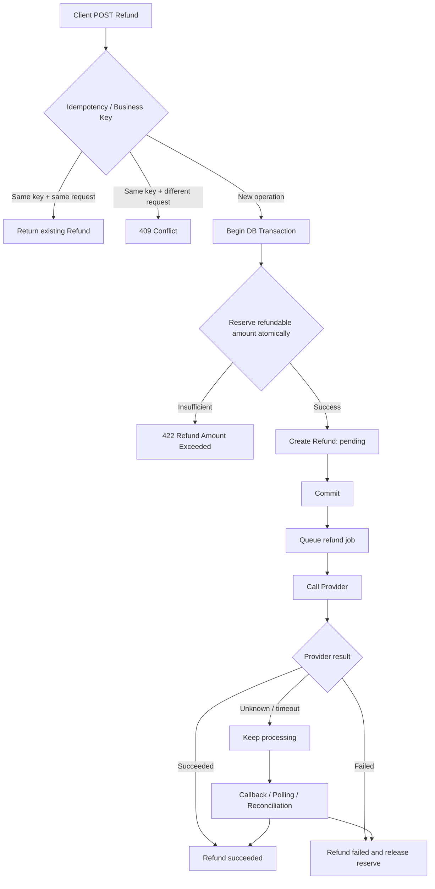

# RESTful 退款 API 設計：從 Resource Modeling 到 Idempotency、Concurrency 與 Reconciliation

#restful-api #http #payment #refund #idempotency #concurrency #transaction #backend #knowledge

## 這是什麼

這份文件以「設計一個退款 API」作為後端工程師面試題，整理從基礎 RESTful API 到正式金流系統會遇到的設計問題。

重點不是背 `GET / POST / PUT / DELETE` 或 HTTP Status Code，而是看面對部分退款、多次退款、timeout retry、併發退款、第三方非同步退款、callback 遺失與 API 重送時，能否維持清楚的 Resource、State Machine、Invariant 與 API Contract。

## 核心結論

- `Refund` 應視為獨立 resource，而不只是 Payment 上的一個動作。
- 部分退款與多次退款不是完全相同的問題；前者在問單筆 Refund 金額，後者在問 Payment 與 Refund 的 1:N 關係。
- Idempotency 要同時處理「同 key 同內容」與「同 key 不同內容」；後者應拒絕，而不是默默回舊結果。
- 商戶退款單號是 business operation identity；`Idempotency-Key` 是 HTTP operation identity，兩者可以同時存在。
- Redis Lock 可以降低 contention，但不能成為金流 correctness 的唯一保證；退款不超額這類 invariant 最後仍要由 DB transaction、constraint 或 atomic conditional update 保證。
- 非同步退款不能只計算已成功退款金額，`pending / processing` 中已保留的退款額度也必須納入。
- 第三方退款不能只依賴 callback；正式系統需要 callback、主動查詢、排程 reconciliation 與人工查詢共同收斂狀態。
- 設計這類 API 時，先定義「什麼條件永遠不能被破壞」，再決定 Redis Lock、DB Lock 或其他實作手段。

---

## 0. 基礎題目

> 設計一個退款 API。
>
> 一筆付款需要支援退款，並逐步追加：
>
> - 可以部分退款嗎？
> - 可以退款很多次嗎？
> - timeout 後 retry 怎麼辦？
> - 同一個 Idempotency-Key，但重送內容不同呢？
> - 兩筆退款同時進來呢？
> - 退款是非同步呢？
> - 第三方退款成功但 callback 丟失呢？
> - API 重送呢？
> - 商戶如何查狀態？
> - 同一筆 Payment 不准超額退款呢？

這些追加題不是彼此獨立的小技巧，而是在測同一個退款模型遇到不同 failure mode 時是否仍然成立。

---

## 1. 先把 Refund 當成 Resource

基礎 API 建議：

```http
POST /payments/{payment_id}/refunds
```

Request：

```json
{
  "amount": 200
}
```

成功建立 Refund：

```http
201 Created
```

```json
{
  "id": "refund_123",
  "payment_id": "payment_123",
  "amount": 200,
  "status": "pending"
}
```

比起：

```http
POST /payment/payment_123/refund
```

前者比較清楚地表達：

> 在 `payment_123` 底下建立一筆 Refund resource。

之後查詢狀態、保存第三方交易編號、錯誤原因與歷程都會自然很多。

如果 `refund_id` 在整個系統中唯一，查詢也可以簡化為：

```http
GET /refunds/refund_123
```

---

## 2. 可以部分退款嗎？

假設原付款：

```text
payment.amount = 1000
```

建立：

```text
Refund #1 = 200
```

這是 partial refund。

這題真正要確認的是：

```text
refund.amount <= refundable_amount
```

Response 不建議使用：

```json
{
  "from": 1000,
  "to": 800
}
```

因為 `from`、`to` 不知道是在表示 Payment balance、商戶錢包、已退款金額，還是剩餘可退款額度。

如果 API 需要回可退款資訊，應使用明確名稱：

```json
{
  "amount": 200,
  "refunded_amount": 200,
  "refundable_amount": 800
}
```

API contract 最重要的不是「人看得懂」，而是每一個欄位的業務定義沒有歧義。

---

## 3. 可以退款很多次嗎？

這和「部分退款」相關，但不是同一題。

部分退款在問：

> 單筆 Refund 是否可以小於 Payment amount？

多次退款在問：

> Payment 與 Refund 是否是 1:N？

例如：

```text
Payment = 1000

Refund #1 = 200 succeeded
Refund #2 = 300 succeeded
Refund #3 = 100 failed
```

資料模型應該是：

```text
payments
    1
    │
    └──── N refunds
```

例如：

```text
payments
--------
id
amount
status

refunds
-------
id
payment_id
amount
status
```

不能只把退款理解成：

```text
payment.balance -= refund_amount
```

因為正式系統還要保存每一筆 Refund 的狀態與歷程。

---

## 4. Timeout 後 Client Retry 怎麼辦？

典型問題：

```text
Client
  │
  │ POST refund
  ▼
Server
  │
  ├── Refund 已建立
  │
  └── Response 在網路上 timeout
```

Client 不知道退款是否成功建立，因此 retry。

解法使用：

```http
Idempotency-Key: abc123
```

Server 至少保存：

```text
idempotency_key
request_fingerprint
refund_id
response/status
```

相同 key + 相同 request 應回原 Refund；相同 key + 不同 request 應拒絕，例如 `409 Conflict`。

---

## 5. 同 Idempotency-Key，但重送內容不同呢？

第一次 amount=200，第二次 amount=500，兩次都使用相同 `Idempotency-Key`，不能視為正常 retry。

```http
409 Conflict
```

```json
{
  "code": "IDEMPOTENCY_KEY_REUSED",
  "message": "Idempotency key was already used with different request data."
}
```

實作上可保存 canonicalized request 後的雜湊值：

```text
idempotency_key
request_hash
refund_id
status
```

---

## 6. 客服後台退款與商戶 API 要分開思考

客服後台通常沒有天然的 `merchant_refund_no`，可使用 `operation_id / idempotency_key` 防止按鈕連點、瀏覽器 timeout、前端 retry、網路 retry。

商戶系統通常可提供自己的退款單號：

```json
{
  "merchant_refund_no": "R202608140001",
  "amount": 200
}
```

DB 應至少對 `merchant_id + merchant_refund_no` 建立 unique constraint。

---

## 7. `Idempotency-Key` 與商戶退款單號不是完全相同的東西

```text
Idempotency-Key
= HTTP operation identity

merchant_refund_no
= Business operation identity
```

兩者可以同時存在。

---

## 8. 同 merchant_refund_no，但內容不同怎麼辦？

同 refund_no + 同 immutable request fields：視為 retry，回原 Refund。

同 refund_no + 不同 immutable request fields：回 `409 Conflict`。

```json
{
  "code": "REFUND_NO_CONFLICT",
  "message": "Refund number already exists with different request data."
}
```

---

## 9. Idempotency 資料可以只放 Redis 嗎？

Redis 適合快速 lookup，但不能讓 Redis TTL 單獨決定「這是不是同一筆退款」。Redis 可以有 TTL，但 correctness 不應因 cache 過期而消失。

```text
Redis
→ 快速 lookup
→ 暫時處理狀態
→ 降低 DB 查詢量

DB
→ Refund 最終紀錄
→ business idempotency
→ correctness source of truth
```

---

## 10. 兩個退款同時進來怎麼辦？

假設 Payment=1000，Request A=700，Request B=700。真正需要保護的不是「request 不要同時進來」，而是 invariant：

```text
succeeded_refund
+ reserved_refund
<= payment.amount
```

---

## 11. Redis Lock 為什麼不應是第一層 correctness guarantee？

Redis Lock 可以降低同一 Payment 同時進 DB 的請求數量，也能減少 DB lock contention，但作為唯一保證會遇到 process crash、TTL 提前到期、Redis failover、network partition、replication delay、lock ownership、lease renewal、fencing token 等問題。

因此 Redis Lock 較適合定位成：

```text
performance / contention optimization
```

而不是 final correctness guarantee。

---

## 12. DB Lock 為什麼適合保護退款 invariant？

```sql
BEGIN;

SELECT *
FROM payments
WHERE id = :payment_id
FOR UPDATE;
```

它的優勢不是 DB 比 Redis 快，而是 Lock、資料讀取與 mutation 都在同一個 transaction system 裡。DB 才是退款資料的 source of truth，因此更容易把「判斷 + 寫入」放在同一個 atomic boundary。

---

## 13. DB Lock 不會提高 DB 負載嗎？

會。大量 `SELECT ... FOR UPDATE` 可能造成 lock contention、transaction wait、connection accumulation、deadlock、DB CPU / IO 壓力。

責任應分清：

```text
Redis Lock
= traffic / contention control

DB Transaction
= atomicity

DB constraint / conditional update
= invariant guarantee
```

---

## 14. 不一定要 `SELECT ... FOR UPDATE`：Conditional Atomic Update

如果要保護的 invariant 很單純，可以直接：

```sql
UPDATE payments
SET reserved_amount = reserved_amount + :refund_amount
WHERE id = :payment_id
  AND amount - refunded_amount - reserved_amount >= :refund_amount;
```

```text
affected_rows = 1
→ reserve 成功

affected_rows = 0
→ 可退款額度不足
```

| 作法 | 主要用途 | Correctness | DB contention |
|---|---|---:|---:|
| Redis Lock | 擋大量同資源 request | 單獨使用不夠 | 低 |
| `SELECT ... FOR UPDATE` | 複雜 transactional invariant | 強 | 較高 |
| Conditional UPDATE | 單純數值 invariant | 強 | 通常較低 |

---

## 15. 非同步退款怎麼設計？

```text
POST Refund
↓
建立 Refund
status = pending
↓
送 Queue
↓
Worker 呼叫 Provider
↓
status = processing
↓
succeeded / failed
```

建立 Refund 可以回 `201 Created`；若 API contract 強調工作已接受但尚未完成，也可以用 `202 Accepted`。

```json
{
  "id": "refund_123",
  "payment_id": "payment_123",
  "amount": 200,
  "status": "pending"
}
```

---

## 16. Async Refund 為什麼需要 reserved amount？

```text
refundable_amount
=
payment.amount
- succeeded_refund
- reserved_refund
```

State Machine 應明確定義哪些狀態占用額度：

```text
pending     → reserve
processing  → reserve
succeeded   → transferred to refunded
failed      → release reserve
```

---

## 17. 第三方退款成功，但 Callback 丟失怎麼辦？

不能只依賴 callback。正式系統通常需要：

```text
callback
+
scheduled polling
+
reconciliation
+
manual query
```

---

## 18. Callback 晚到或重送怎麼辦？

Callback handler 必須 idempotent。`succeeded → succeeded` 應是 no-op，不能再次執行 balance adjustment、ledger entry 或 refund completion event。

---

## 19. 「API 重送」要先問是哪一段

至少拆成：Merchant → 我方、我方 → Provider、Provider → 我方 Callback。不同 boundary 的 retry 處理方式不同。

我方 → Provider timeout 最危險，因 Provider 可能其實已成功，因此要依 Provider 能力使用 provider idempotency key、provider request id 或 query-before-retry。

---

## 20. 商戶怎麼查退款狀態？

如果 `refund_id` 全系統唯一：

```http
GET /refunds/refund_123
```

```json
{
  "id": "refund_123",
  "payment_id": "payment_123",
  "amount": 200,
  "status": "processing",
  "failure_code": null,
  "failure_message": null
}
```

---

## 21. 超額退款該回什麼？

```http
422 Unprocessable Content
```

```json
{
  "code": "REFUND_AMOUNT_EXCEEDED",
  "message": "Refund amount exceeds refundable amount",
  "details": {
    "payment_amount": 1000,
    "refunded_amount": 800,
    "reserved_amount": 0,
    "refundable_amount": 200,
    "requested_amount": 300
  }
}
```

不要只寫「餘額不足」，因為這裡不是 Wallet balance，而是 Payment 的 refundable amount 不足。

---

## 22. 完整退款流程



真正不能被破壞的是：

```text
succeeded_refund
+ reserved_refund
<= payment.amount
```

---

## 23. 面試回答應該怎麼分層

如果只回答「用 Redis Lock」，代表知道工具，但還沒講清楚問題。

更完整的回答應先定義 invariant，再決定 DB conditional atomic update、transaction + `SELECT ... FOR UPDATE`，最後視流量需求使用 Redis Lock 作為 contention reduction。

```text
工具導向：
「我要用哪一種 Lock？」

設計導向：
「哪一個 invariant 不能被破壞？」
```

---

## 24. 這題真正測什麼

| 層級 | 核心問題 |
|---|---|
| Resource | Refund 是不是獨立 resource？ |
| State Machine | `pending / processing / succeeded / failed` 如何轉換？ |
| Invariant | 如何永遠保證不超額退款？ |
| API Contract | Retry、HTTP status、error response、query 如何定義？ |

進入 production 後還會延伸 Idempotency、Concurrency、Atomicity、Async processing、Provider retry、Callback idempotency、Reconciliation、Audit trail。

---

## 25. 最後判斷原則

遇到退款、轉帳、提款、付款、取消訂單這類 API，都先依序問：

1. **Resource 是什麼？**
2. **State Machine 是什麼？**
3. **哪個 Invariant 永遠不能被破壞？**
4. **誰會 Retry？在哪一個 boundary？**
5. **Idempotency identity 是 HTTP 層還是 Business 層？**
6. **Correctness 最後由誰保證？**
7. **第三方狀態不一致時如何 reconciliation？**

最重要的一句：

> **Lock 不是目的，維持 invariant 才是目的。**